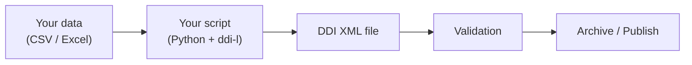

# Module 1: What is metadata and why does it matter?

!!! info "What you will learn"
    - Define metadata in your own words.
    - Explain why data without documentation is hard to use.
    - Describe what DDI is and who uses it.
    - Explain how DDI helps make data FAIR (Findable, Accessible,
      Interoperable, Re-usable).
    - Describe what `ddi-l` does.

**Prerequisites:** None.

**Time:** 30 min self-paced / 45 min instructor-led.

---

## 1. What is metadata?

Metadata is **information about your data**. Think of a library card catalog.
The catalog does not contain the full text of every book. Instead, it tells you
the title, author, subject, and where to find each book. Metadata does the
same thing for data files. It tells you what the data is about without showing
you all the data.

Here are a few examples of metadata:

- The title of a survey.
- The date the data was collected.
- The meaning of each column in a table.

Without metadata, a data file is just rows and columns of numbers. No one
knows what those numbers mean.

---

## 2. Real-world example: a household survey table

Look at the table below. It comes from a household survey.

| Column A | Column B | Column C |
| -------: | -------- | -------: |
|       34 | Female   |   52 000 |
|       28 | Male     |   41 000 |
|       45 | Female   |   67 000 |
|       22 | Male     |   29 000 |
|       51 | Other    |   73 000 |

**Without documentation** you might ask:

- What do the numbers in Column A mean? Ages? ID numbers?
- Is Column C in dollars, euros, or another currency?
- Who was surveyed? Adults only? Everyone?
- When was the survey done?

**With documentation** we add metadata:

| Age | Gender | Annual Income (CAD) |
| --: | ------ | ------------------: |
|  34 | Female |              52 000 |
|  28 | Male   |              41 000 |
|  45 | Female |              67 000 |
|  22 | Male   |              29 000 |
|  51 | Other  |              73 000 |

- **Study title:** Canadian Household Income Survey 2024
- **Population:** Canadian adults aged 18 and older.
- **Collection period:** January-March 2024.

Now the data makes sense. Metadata is the difference between confusion and
clarity.

---

## 3. What is DDI?

**DDI** stands for **Data Documentation Initiative**. It is an international
standard (a set of agreed-upon rules) for describing surveys, censuses, and
datasets. Governments, universities, and research organizations around the
world use DDI to document their data so that others can find it, understand it,
and reuse it.

Key facts about DDI:

- It is maintained by the [DDI Alliance](https://ddialliance.org).
- It uses XML (a structured text format) to store the documentation.
- It covers the full life of a dataset, from planning and collection to
  archiving and sharing.

---

## 4. How DDI makes data FAIR

**FAIR** is a set of four principles that help people share and reuse data.
The letters stand for **Findable**, **Accessible**, **Interoperable**, and
**Re-usable**. Good data should follow all four. DDI-Lifecycle helps you meet
each one.

| Principle | What it means | How DDI helps |
| ----------- | --------------- | --------------- |
| **Findable** | People can search for and discover the data. | DDI gives every item a unique identifier and stores structured fields like title, agency, and concepts. Data catalogs can index these fields so users find your dataset in a search. |
| **Accessible** | People can get the data and its documentation. | DDI files are standard XML. Any tool that reads XML can open them. No special software is required. |
| **Interoperable** | Data works with other data and tools. | DDI uses shared code lists and controlled vocabularies. When two surveys use the same code list for gender or employment status, their data can be combined and compared. |
| **Re-usable** | People understand the data well enough to use it correctly. | DDI records who collected the data, when, how, and what each variable means. A researcher in another country can read the DDI file and know exactly what the data contains. |

### Example: FAIR in action

Imagine Dr. Chen publishes a health survey to an open data repository. Without
DDI metadata, a visitor sees a file called `health-2024.csv` and has no idea
what is inside.

With DDI metadata:

- **Findable**: The repository indexes the DDI title, concepts ("Physical
  Health", "Mental Health"), and agency ("health-research.example.org"). A
  student searching for "mental health survey data" finds it.
- **Accessible**: The DDI XML file is published next to the CSV. Anyone can
  download both files with no login or special tool.
- **Interoperable**: The DDI file uses a standard code list for gender
  (Male / Female / Other). Another team in France uses the same code list, so
  both datasets can be merged for cross-country analysis.
- **Re-usable**: The DDI file says the data was collected from adults aged
  18+ in 2024, that "bmi" is body mass index in kg/m², and that income is in
  Canadian dollars. A new researcher can use the data correctly without asking
  the original team.

Without DDI, the data sits in a file that nobody finds, nobody understands,
and nobody reuses. With DDI, the data becomes a shared resource.

---

## 5. What is ddi-l?

`ddi-l` is a **Python package** (a tool you install and use in the Python
programming language) that lets you **create, read, update, and validate** DDI
documents. You do not need to know XML to use it. You write a few lines of
Python, and `ddi-l` handles the XML for you.

What `ddi-l` can do:

- **Create** a new DDI study with questions and variables.
- **Read** an existing DDI file and inspect its contents.
- **Update** a DDI document by adding or removing items.
- **Validate** a document to make sure it follows the DDI rules.

---

## 6. The big picture

Here is the typical workflow when you use `ddi-l`:

1. You start with a data file (for example, a CSV or Excel spreadsheet).
2. You write a short Python script that uses `ddi-l` to describe the data.
3. `ddi-l` creates a DDI XML file.
4. You validate the file to make sure everything is correct.
5. You archive or publish the file so others can find and understand your data.

---

## 7. Who uses DDI? Four stories

**Maya, university student.**
Maya just finished her thesis on student stress. She needs to deposit her
survey data in the university's research repository. DDI metadata helps
future students find and understand her dataset.

**Dr. Chen, researcher.**
Dr. Chen runs a multi-country health study. He publishes data to an open
repository. DDI makes his datasets discoverable and comparable across
countries.

**Fatima, archivist.**
Fatima manages a data collection at a national library. She uses DDI to
catalog thousands of datasets so researchers can search and browse the
collection.

**Jean-Pierre, National Statistics Office (NSO) staff.**
Jean-Pierre works at a government statistics office. His team documents every
census and survey with DDI so the public can access reliable, well-documented
data.

---

## Exercises

!!! example "Scenario"
    You receive a data file with no documentation. The file has five rows and
    the columns are labeled A, B, and C. The values look like numbers and
    short words.

**Exercise 1.** Look at the table below.

| A  | B      |     C |
| -: | ------ | ----: |
| 34 | Female | 52000 |
| 28 | Male   | 41000 |
| 45 | Female | 67000 |
| 22 | Male   | 29000 |
| 51 | Other  | 73000 |

Write down **3 things** a new person would need to know before they could use
this data. For example: What does column A measure?

??? success "Answer"
    Any three of these, or similar:

    1. What each column means (is A an age? In years or months?)
    2. Who was surveyed (students? adults? everyone?)
    3. When the data was collected

**Exercise 2.** Visit <https://ddialliance.org> and find one sentence on the
site that describes what DDI does. Write that sentence down.

??? success "Answer"
    For example: "The Data Documentation Initiative (DDI) is an international
    standard for describing data from the social, behavioral, economic, and health
    sciences."

---

## Quiz

???+ question "Question 1: What is metadata?"
    **A.** The raw data in a spreadsheet.

    **B.** Information about data, like a label or description that tells you
    what the data means.

    **C.** A type of programming language.

    **D.** A file format used only by governments.

    ??? success "Answer"
        **B.** Metadata is information about data. It describes what the data
        means, where it came from, and how it was collected.

???+ question "Question 2: Why does documentation matter?"
    **A.** It makes the data file smaller.

    **B.** It is required by Python.

    **C.** Without it, people cannot understand what the data means or how to
    use it correctly.

    **D.** It changes the values in the dataset.

    ??? success "Answer"
        **C.** Without documentation, data is just numbers and labels with no
        context. People may misinterpret or misuse the data.

???+ question "Question 3: What does FAIR stand for?"
    **A.** Fast, Automated, Indexed, Reliable.

    **B.** Findable, Accessible, Interoperable, Re-usable.

    **C.** File, Archive, Import, Report.

    **D.** Format, Align, Inspect, Review.

    ??? success "Answer"
        **B.** FAIR stands for Findable, Accessible, Interoperable, and
        Re-usable. These four principles guide how data should be shared so
        that others can discover, understand, and reuse it. DDI metadata
        helps you meet all four.

???+ question "Question 4: What does ddi-l do?"
    **A.** It collects survey responses from people.

    **B.** It is a Python tool that creates, reads, updates, and validates DDI
    documents.

    **C.** It converts Python code into Excel files.

    **D.** It replaces Microsoft Word for writing reports.

    ??? success "Answer"
        **B.** `ddi-l` is a Python package for working with DDI metadata
        documents. It handles the XML so you can focus on your data.

---

!!! tip "Instructor notes"
    - **Opening activity:** Start with the "messy table" exercise (Exercise 1).
      Give learners the unlabeled table and ask them to guess what the data
      means. This builds motivation for the rest of the module.
    - **Audience adaptation:** Use the census example for NSO audiences. Use the
      thesis example for university students.
    - **Discussion prompt:** Ask learners to share a time they received a file
      with no documentation. What questions did they have?
    - **Closing:** Reinforce that `ddi-l` makes documentation easy: you
      write Python, and the tool creates the standard XML for you.
