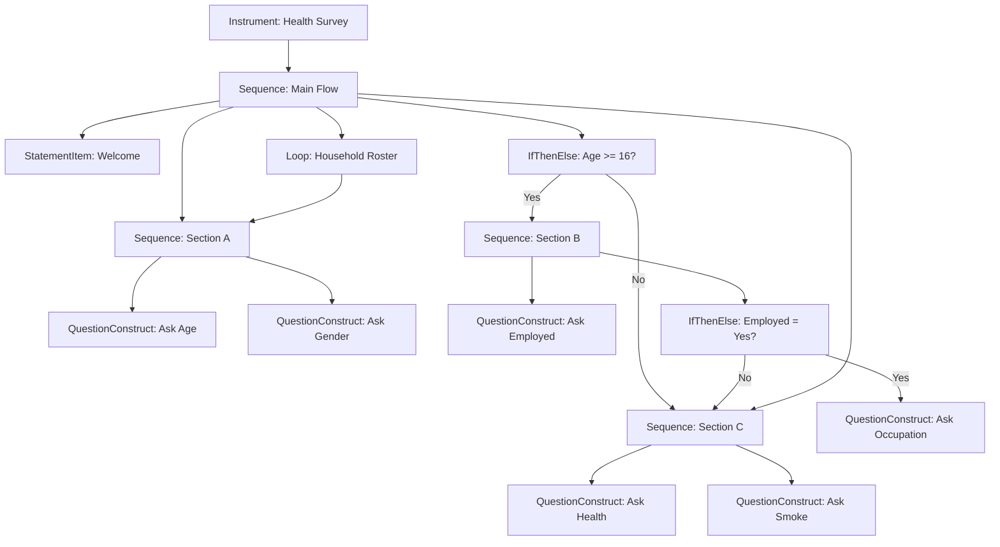

# Module 8: Map a Questionnaire to DDI Flow Logic

!!! info "What you will learn"
    - Read a paper questionnaire specification and identify its flow logic.
    - Map each part of the spec to a DDI **control construct**: `Sequence`, `QuestionConstruct`, `IfThenElse`, `StatementItem`.
    - Build skip patterns with `IfThenElse` and `ElseIf`.
    - Understand how DDI represents loops for household rosters and repeated sections.
    - Connect an `Instrument` to a top-level `Sequence`.

**Prerequisites:** [Module 7: Code Lists](module-07-code-lists.md).

**Time:** 50 min self-paced / 60 min instructor-led.

---

## 1. From paper to DDI

Most questionnaires start as a written specification.
The spec lists the questions in order and describes **skip patterns**: rules like "If the respondent is under 18, skip to Section C."

Your job is to turn that spec into DDI metadata so that the flow logic is machine-readable.
This module teaches you how.

## 2. A sample questionnaire spec

Here is a simple health survey specification.
Read it carefully; we will map every part to DDI.

!!! example "Health Survey Spec"

    **Section A: Demographics**

    - A1. What is your age? *(numeric)*
    - A2. What is your gender? *(code list: Male, Female, Other)*

    **Section B: Employment** *(skip if age < 16)*

    - B1. Are you currently employed? *(Yes / No)*
    - B2. What is your occupation? *(text, ask only if B1 = Yes)*

    **Section C: Health**

    - C1. How would you rate your general health? *(code list: Excellent, Good, Fair, Poor)*
    - C2. Do you smoke? *(Yes / No)*

    **Household Roster** *(repeat Section A for each household member)*

## 3. The DDI building blocks

Each part of the spec maps to a DDI **control construct**:

| Spec element | DDI construct | What it does |
| --- | --- | --- |
| A section intro | `StatementItem` | Shows text without asking a question |
| A question | `QuestionConstruct` | Asks one question |
| An ordered section | `Sequence` | Groups steps in order |
| "Skip if..." | `IfThenElse` | Branches based on a condition |
| "Ask only if..." | `IfThenElse` | Same; the condition decides which path |
| "Repeat for each..." | `Loop` | Repeats a section for a list of items |
| The whole questionnaire | `Instrument` | Points to the top-level Sequence |

All of these live in the `ddi_l.models.datacollection` module:

```python
from ddi_l.models.datacollection import (
    Instrument,
    Sequence,
    QuestionConstruct,
    IfThenElse,
    ElseIf,
    StatementItem,
)
```

!!! tip "Two things to remember"
    - You create every construct with the same `doc.add_item(<Type>, name="...")`
      call you already use for questions and variables.
    - You **link** constructs to one another with `.to_reference()`. A
      reference says "this construct points to that one". It carries the
      target's identifier and type so the file stays valid.

## 4. Step 1: Create the study and questions

First, create the study and all the questions from the spec.
Each question becomes a DDI question item.

```python
import ddi_l as ddi

doc = ddi.new_study(title="National Health Survey", agency="health.gc.ca")

# Section A
q_age = doc.add_question(text="What is your age?")
q_gender = doc.add_question(text="What is your gender?")

# Section B
q_employed = doc.add_question(text="Are you currently employed?")
q_occupation = doc.add_question(text="What is your occupation?")

# Section C
q_health = doc.add_question(text="How would you rate your general health?")
q_smoke = doc.add_question(text="Do you smoke?")

print(f"Questions: {len(doc.questions)}")  # -> Questions: 6
```

## 5. Step 2: Create QuestionConstructs

A **QuestionConstruct** wraps a question so it can be placed in a Sequence.
Think of it as the instruction "now ask this question."

Add one for each question, and point it at the question with `.to_reference()`:

```python
qc_age = doc.add_item(
    QuestionConstruct, name="Ask Age", question_reference=q_age.to_reference()
)
qc_gender = doc.add_item(
    QuestionConstruct, name="Ask Gender", question_reference=q_gender.to_reference()
)
qc_employed = doc.add_item(
    QuestionConstruct, name="Ask Employed", question_reference=q_employed.to_reference()
)
qc_occupation = doc.add_item(
    QuestionConstruct,
    name="Ask Occupation",
    question_reference=q_occupation.to_reference(),
)
qc_health = doc.add_item(
    QuestionConstruct,
    name="Ask Health Rating",
    question_reference=q_health.to_reference(),
)
qc_smoke = doc.add_item(
    QuestionConstruct, name="Ask Smoke", question_reference=q_smoke.to_reference()
)

print(f"QuestionConstructs: {len(doc.items(QuestionConstruct))}")
# -> QuestionConstructs: 6
```

## 6. Step 3: Build Sequences for each section

The spec has three sections (A, B, C).
Each section becomes a `Sequence` that lists its steps in order. You list the
steps with `control_construct_references`, one reference per step:

```python
seq_demographics = doc.add_item(
    Sequence,
    name="Section A - Demographics",
    control_construct_references=[qc_age.to_reference(), qc_gender.to_reference()],
)
seq_employment = doc.add_item(
    Sequence,
    name="Section B - Employment",
    control_construct_references=[qc_employed.to_reference()],
)
seq_health = doc.add_item(
    Sequence,
    name="Section C - Health",
    control_construct_references=[qc_health.to_reference(), qc_smoke.to_reference()],
)
```

You can also add a **StatementItem** to introduce a section. It shows a
message instead of asking a question:

```python
intro_a = doc.add_item(StatementItem, name="Welcome to the National Health Survey")
```

## 7. Step 4: Model skip patterns with IfThenElse

The spec says: *"Skip Section B if age < 16."*
In DDI, this becomes an `IfThenElse` construct.

An `IfThenElse` has three parts:

- **If condition**: the rule to check (age >= 16)
- **Then**: which construct to run if true (Section B)
- **Else**: which construct to run if false (skip to Section C)

Create it with `add_item()`, set the rule with `set_condition()`, then connect
the branches with `.to_reference()`:

```python
skip_employment = doc.add_item(IfThenElse, name="Age gate for employment")
skip_employment.set_condition("age >= 16", description="Working age")
skip_employment.then_construct_reference = seq_employment.to_reference()
skip_employment.else_construct_reference = seq_health.to_reference()
```

For multi-way routing ("if 16-64 ask employment, if 65+ ask retirement"), add
`ElseIf` branches with `add_elseif()`:

```python
seq_retirement = doc.add_item(
    Sequence,
    name="Section B2 - Retirement",
    control_construct_references=[qc_employed.to_reference()],
)

skip_employment.add_elseif(seq_retirement.to_reference(), command="age >= 65")
```

## 8. Step 5: Model "ask only if" with a nested IfThenElse

The spec says: *"Ask B2 (occupation) only if B1 = Yes."*
This is another `IfThenElse`, this time inside Section B.
The "then" path runs the occupation QuestionConstruct; the "else" path is
left empty, so the question is skipped:

```python
ask_occupation = doc.add_item(IfThenElse, name="Occupation routing")
ask_occupation.then_construct_reference = qc_occupation.to_reference()
```

## 9. Step 6: Model a household roster with Loop

The spec says: *"Repeat Section A for each household member."*
DDI represents this with a **Loop** construct.

A Loop repeats a control construct (usually a Sequence) for each item in a
list. For example, it runs the demographics section once per household
member. Add it like any other construct, and point it at the section it
repeats with `control_construct_reference`:

```python
from ddi_l.models.datacollection import Loop

roster_loop = doc.add_item(Loop, name="Household roster loop")
roster_loop.control_construct_reference = seq_demographics.to_reference()
```

## 10. Step 7: Build the main Sequence and Instrument

The **main Sequence** defines the overall flow of the questionnaire.
It references the section sequences, the IfThenElse gates, and the loop, in order.

```python
main_seq = doc.add_item(
    Sequence,
    name="Main Survey Flow",
    control_construct_references=[
        intro_a.to_reference(),
        seq_demographics.to_reference(),
        skip_employment.to_reference(),
        seq_health.to_reference(),
    ],
)
```

The order would be:

1. `StatementItem`: Welcome
2. `Sequence`: Section A (Demographics)
3. `IfThenElse`: Age gate (→ Section B or skip)
4. `Sequence`: Section C (Health)
5. `Loop`: Household roster

Finally, create an **Instrument** that points to the main Sequence.
The Instrument is the top-level entry point: it says "this is the
questionnaire."

```python
instrument = doc.add_item(Instrument, name="Health Survey Instrument")
instrument.control_construct_reference = main_seq.to_reference()
print(f"Instruments: {len(doc.items(Instrument))}")  # -> Instruments: 1

# The whole flow is valid DDI:
assert doc.validate() == []
```

The second line is the one that matters. Without it the Instrument has a
name and nothing else (a questionnaire that administers nothing), and the
document is still perfectly valid, because the schema does not require the
link. Only the `ControlConstructReference` connects the entry point to the
flow you just built.

## 11. The complete mapping

Here is the full spec mapped to DDI, as a diagram:



## 12. Mapping checklist

Use this checklist when you map any questionnaire spec to DDI:

- [ ] List all questions → `add_item(QuestionConstruct, ...)` for each
- [ ] Identify sections → `add_item(Sequence, ...)` for each
- [ ] Find "skip if..." rules → `add_item(IfThenElse, ...)` for each
- [ ] Find "ask only if..." rules → `add_item(IfThenElse, ...)` for each
- [ ] Find "repeat for each..." rules → `add_item(Loop, ...)` for each
- [ ] Find section introductions → `add_item(StatementItem, ...)` for each
- [ ] Build the main `Sequence` that ties everything together
- [ ] Create the `Instrument` that points to the main Sequence
- [ ] Add `ElseIf` branches for multi-way routing (e.g., age groups)

---

!!! example "Scenario"
    You received the Health Survey spec above from your research team.
    Your task: create the DDI document with all questions,
    build the flow logic with Sequences and IfThenElse branches,
    and connect everything to an Instrument.

---

## Exercises

1. Create a study for the Health Survey. Add all 6 questions from the spec. Print the count.

    **Expected output:**

    ```text
    Questions: 6
    ```

2. Add a `QuestionConstruct` for each question and a `Sequence` for each section (A, B, C). Print the counts.

    **Expected output:**

    ```text
    QuestionConstructs: 6
    Sequences: 3
    ```

3. Add two `IfThenElse` items: one for the age gate ("Skip Section B if age < 16") and one for the occupation routing ("Ask B2 only if B1 = Yes"). Print the count.

    **Expected output:**

    ```text
    IfThenElse: 2
    ```

4. Add the main `Sequence`, a `StatementItem` for the welcome message, and an `Instrument`. Print the final counts.

    ```python
    doc.add_item(Sequence, name="Main Survey Flow")
    doc.add_item(StatementItem, name="Welcome")
    doc.add_item(Instrument, name="Health Survey Instrument")

    print(f"Sequences: {len(doc.items(Sequence))}")
    print(f"StatementItems: {len(doc.items(StatementItem))}")
    print(f"Instruments: {len(doc.items(Instrument))}")
    ```

    **Expected output:**

    ```text
    Sequences: 4
    StatementItems: 1
    Instruments: 1
    ```

5. (Bonus) Draw a flowchart of your own survey (real or imaginary) on paper. Label each box with the DDI construct type. Then build it in Python with `add_item()` and link the constructs with `.to_reference()`.

---

## Quiz

???+ question "Q1: What DDI construct represents an ordered section of a questionnaire?"
    **A.** `Instrument`

    **B.** `Sequence`

    **C.** `IfThenElse`

    **D.** `QuestionConstruct`

    ??? success "Answer"
        **B.** A `Sequence` groups steps in order, like a section
        of a questionnaire.

???+ question "Q2: How do you model 'skip to Section C if age < 16' in DDI?"
    **A.** Delete the questions for Section B.

    **B.** Use a `StatementItem`.

    **C.** Use an `IfThenElse` with a condition on age.

    **D.** Use a `Loop`.

    ??? success "Answer"
        **C.** An `IfThenElse` checks the age condition and routes
        the respondent to Section B (then) or Section C (else).

???+ question "Q3: What is the purpose of a QuestionConstruct?"
    **A.** It defines the text of a question.

    **B.** It wraps a question so it can be placed in a Sequence.

    **C.** It creates a code list for a question.

    **D.** It validates a question.

    ??? success "Answer"
        **B.** A `QuestionConstruct` wraps a question reference so
        the question can participate in the flow logic (be placed
        in a Sequence, be the target of an IfThenElse, etc.).

???+ question "Q4: What DDI construct repeats a section for each household member?"
    **A.** `Sequence`

    **B.** `IfThenElse`

    **C.** `ElseIf`

    **D.** `Loop`

    ??? success "Answer"
        **D.** A `Loop` repeats a control construct (usually a
        Sequence) for each item in a list, such as each household
        member.

???+ question "Q5: What is the first step when mapping a questionnaire spec to DDI?"
    **A.** Create the Instrument.

    **B.** Build the main Sequence.

    **C.** List all questions and create QuestionConstructs.

    **D.** Write the XML by hand.

    ??? success "Answer"
        **C.** Start by identifying all the questions in the spec
        and creating a QuestionConstruct for each one. Then build
        the Sequences and flow logic around them.

---

!!! tip "Instructor notes"
    - Start with the paper spec on screen. Ask learners to circle every question, underline every skip rule, and box every "repeat" instruction. This makes the mapping concrete before touching code.
    - Draw the flowchart on a whiteboard. Label each box with the DDI construct name. Then translate box-by-box to Python.
    - Stress the `.to_reference()` habit: every time one construct points to another (a Sequence to its steps, an IfThenElse to its branches), the link is a reference, not the object itself. References keep the file valid because they carry the target's identifier and type.
    - Common confusion: "Why do I need both a Question and a QuestionConstruct?" Answer: the Question is the content ("What is your age?"). The QuestionConstruct is the instruction ("now ask this question"). The Sequence says "ask these in this order." Separating content from flow lets you reuse the same question in different instruments.
    - For the Loop: show a household roster form where the same section repeats per person. Ask: "How many times does this section run?" Answer: "It depends on how many people live in the household." That is a loop.
    - Use ElseIf for multi-way branches: "If age < 16 → skip. If 16-64 → ask employment. If 65+ → ask retirement." This maps to one IfThenElse with ElseIf branches.
    - Exercise 5 (draw your own spec) is excellent for group work. Pairs can swap specs and map each other's questionnaires.

---

**See also:** [Module 7: Code lists](module-07-code-lists.md) | [User guide: Any item type](../user-guide.md#work-with-any-item-type)
