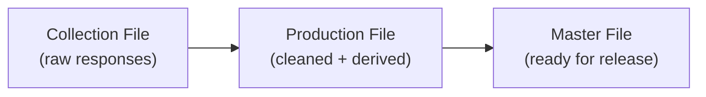
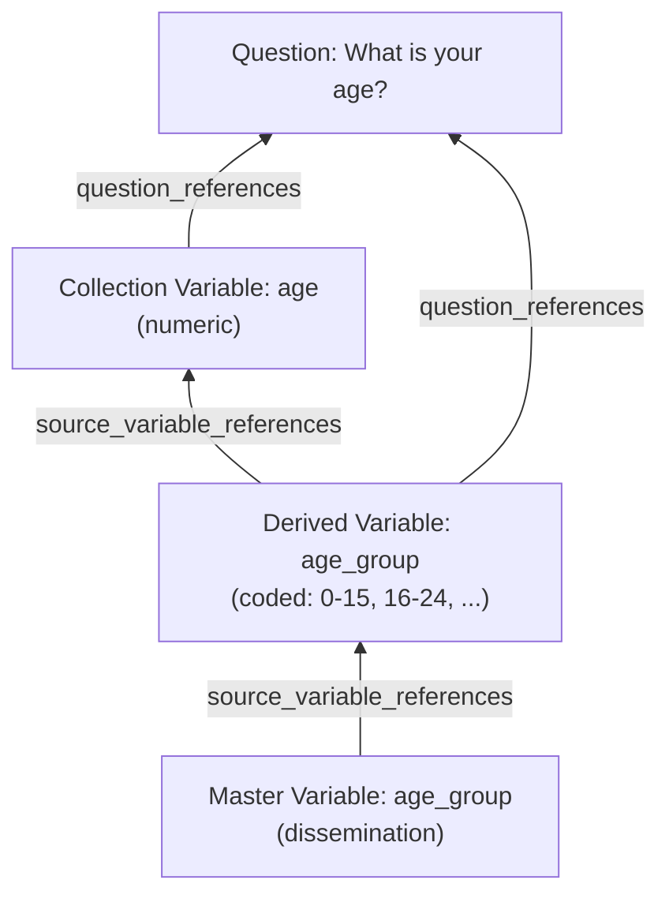
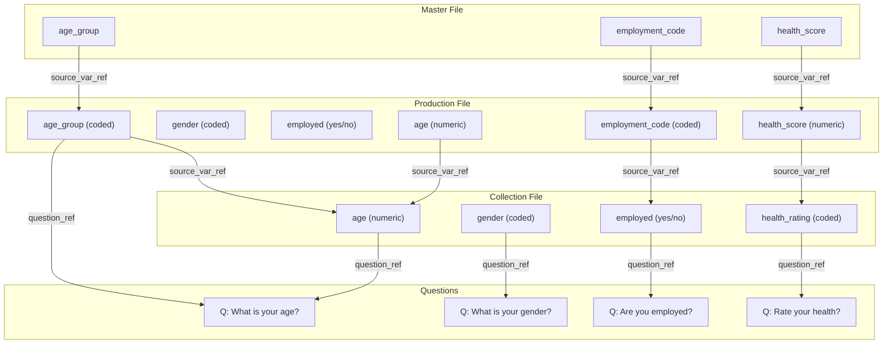

# Module 9: Document Data Files and Variable Lineage

!!! info "What you will learn"
    - Understand the three stages of survey data: **collection**, **production**, and **dissemination**.
    - Create variables with different representations (`NumericRepresentation`, `CodeRepresentation`, `TextRepresentation`).
    - Link every variable back to its **source question** with `question_references`.
    - Model **derived variables** using `source_variable_references` for lineage.
    - Track the **based-on relationship** between collection and production variables.
    - Build a complete provenance chain from dissemination file back to the original questionnaire.

**Prerequisites:** [Module 8: Questionnaire Flows](module-08-questionnaire-flows.md).

**Time:** 60 min self-paced / 75 min instructor-led.

---

## 1. What happens after data collection?

In Module 8 you built a questionnaire.
When respondents answer that questionnaire, the responses become **data files**.

But the raw data rarely goes straight to users.
It passes through stages:



Each stage has its own set of variables.
DDI lets you document every stage and track how each variable connects back to the others.
This is called **data lineage** or **provenance**.

## 2. The three data files

We will use the Health Survey from Module 8 as our running example.

!!! example "Three data files"

    **Collection file**: raw responses exactly as collected.

    | respondent_id | age | gender | employed | occupation | health_rating | smoker |
    |---|---|---|---|---|---|---|
    | R001 | 34 | Female | Yes | Teacher | Good | No |
    | R002 | 17 | Male | No | | Fair | No |
    | R003 | 68 | Female | No | | Excellent | Yes |

    **Production file**: cleaned data with both original and **derived** variables.

    | respondent_id | age | gender | employed | age_group | employment_status_code | health_score |
    |---|---|---|---|---|---|---|
    | R001 | 34 | 2 | 1 | 3 | 1 | 3 |
    | R002 | 17 | 1 | 0 | 2 | 0 | 2 |
    | R003 | 68 | 2 | 0 | 5 | 0 | 4 |

    **Master file**: only the final derived variables, ready for dissemination.

    | respondent_id | age_group | employment_status_code | health_score |
    |---|---|---|---|
    | R001 | 3 | 1 | 3 |
    | R002 | 2 | 0 | 2 |
    | R003 | 5 | 0 | 4 |

## 3. Set up the study

Start by creating the study and the questions from our Health Survey.

```python
import ddi_l as ddi
from ddi_l.models.logicalproduct import (
    Variable,
    CodeList,
    Category,
    CodeItem,
    VariableRepresentation,
    NumericRepresentation,
    CodeRepresentation,
    TextRepresentation,
    NumberRange,
)
from ddi_l.models.datacollection import QuestionConstruct
from ddi_l.models.base import Reference, InternationalString

doc = ddi.new_study(
    title="National Health Survey: Data Documentation",
    agency="health.gc.ca",
)

# Create the source questions
q_age = doc.add_question(text="What is your age?")
q_gender = doc.add_question(text="What is your gender?")
q_employed = doc.add_question(text="Are you currently employed?")
q_occupation = doc.add_question(text="What is your occupation?")
q_health = doc.add_question(text="How would you rate your general health?")
q_smoke = doc.add_question(text="Do you smoke?")
```

## 4. Build the collection variables

**Collection variables** capture exactly what was asked.
Each one has a **representation** (numeric, text, or coded) and a link back to its **source question**.

### Numeric variable: age

```python
v_age = doc.add_variable(name="age", question=q_age)
```

The `question=` parameter automatically creates a `question_references` entry linking this variable to the question it came from.

### Coded variable: gender

For coded variables, you first create a `CodeList`, then set the variable's representation to use it.

```python
# Create the Gender code list
cl_gender = doc.add_code_list(name="Gender Codes")
doc.add_item(Category, name="Male")
doc.add_item(Category, name="Female")
doc.add_item(Category, name="Other")
```

### Text variable: occupation

```python
v_occupation = doc.add_variable(name="occupation", question=q_occupation)
```

### Build all collection variables

```python
v_gender = doc.add_variable(name="gender", question=q_gender)
v_employed = doc.add_variable(name="employed", question=q_employed)
v_health = doc.add_variable(name="health_rating", question=q_health)
v_smoke = doc.add_variable(name="smoker", question=q_smoke)

print(f"Collection variables: {len(doc.variables)}")
# -> Collection variables: 6
```

Every collection variable references its source question.
This is the first link in the provenance chain.

## 5. What is a derived variable?

A **derived variable** is computed from one or more existing variables.

Examples:

| Derived variable | Source variable(s) | Derivation |
| --- | --- | --- |
| `age_group` | `age` | Recode: 0-15→1, 16-24→2, 25-44→3, 45-64→4, 65+→5 |
| `employment_status_code` | `employed` | Recode: Yes→1, No→0 |
| `health_score` | `health_rating` | Recode: Excellent→4, Good→3, Fair→2, Poor→1 |

In DDI, you track this derivation with `source_variable_references`, a list of references pointing to the variables that were used to compute the derived value.

## 6. Create derived variables with source references

### Step 1: Create the age_group code list

```python
cl_age_group = doc.add_code_list(name="Age Group Codes")
doc.add_item(Category, name="0-15")
doc.add_item(Category, name="16-24")
doc.add_item(Category, name="25-44")
doc.add_item(Category, name="45-64")
doc.add_item(Category, name="65+")
```

### Step 2: Create the derived variable

```python
v_age_group = doc.add_variable(name="age_group", question=q_age)
```

### Step 3: Link it to its source variable

The key field is `source_variable_references`.
It tells anyone reading the metadata: "This variable was derived from these other variables."

```python
v_age_group.source_variable_references = [
    Reference(
        agency="health.gc.ca",
        identifier=v_age.identifier,
        version="1",
    ),
]
```

Now `age_group` has two provenance links:

- **Question source**: points to "What is your age?" (set by `question=q_age`)
- **Variable source**: points to the collection variable `age` (set by `source_variable_references`)

## 7. Build all production variables

The production file has both the original collection variables **and** the derived variables.

```python
# Derived: employment_status_code from employed
v_emp_code = doc.add_variable(name="employment_status_code", question=q_employed)
v_emp_code.source_variable_references = [
    Reference(
        agency="health.gc.ca",
        identifier=v_employed.identifier,
        version="1",
    ),
]

# Derived: health_score from health_rating
v_health_score = doc.add_variable(name="health_score", question=q_health)
v_health_score.source_variable_references = [
    Reference(
        agency="health.gc.ca",
        identifier=v_health.identifier,
        version="1",
    ),
]

print(f"Total variables (collection + derived): {len(doc.variables)}")
# -> Total variables (collection + derived): 9
```

## 8. The provenance chain

Every variable in the production file can be traced back to:

1. **Its source question** → "What was asked?"
2. **Its source variable(s)** → "What data was it computed from?"

And every collection variable can be traced to:

1. **Its source question** → "What was asked?"

This creates a full **lineage chain**:



Reading from bottom to top, you can answer:

- "Where does `age_group` in the master file come from?" → From the production variable `age_group`.
- "Where does the production `age_group` come from?" → Derived from `age` in the collection file.
- "Where does `age` come from?" → From the question "What is your age?"

## 9. Build the master file variables

The master file contains only the derived variables that are ready for dissemination.
These reference the production-stage derived variables as their source.

```python
# Master file variables reference the production variables as source
v_master_age_group = doc.add_variable(name="age_group_master", question=q_age)
v_master_age_group.source_variable_references = [
    Reference(
        agency="health.gc.ca",
        identifier=v_age_group.identifier,
        version="1",
    ),
]

v_master_emp = doc.add_variable(
    name="employment_status_master",
    question=q_employed,
)
v_master_emp.source_variable_references = [
    Reference(
        agency="health.gc.ca",
        identifier=v_emp_code.identifier,
        version="1",
    ),
]

v_master_health = doc.add_variable(
    name="health_score_master",
    question=q_health,
)
v_master_health.source_variable_references = [
    Reference(
        agency="health.gc.ca",
        identifier=v_health_score.identifier,
        version="1",
    ),
]

print(f"Master variables: 3")
print(f"Total variables in document: {len(doc.variables)}")
# -> Total variables in document: 12
```

## 10. A variable with multiple sources

Some derived variables combine **more than one** source variable.
For example, a Body Mass Index (BMI) variable is derived from both `height` and `weight`.

```python
q_height = doc.add_question(text="What is your height in cm?")
q_weight = doc.add_question(text="What is your weight in kg?")

v_height = doc.add_variable(name="height_cm", question=q_height)
v_weight = doc.add_variable(name="weight_kg", question=q_weight)

v_bmi = doc.add_variable(name="bmi")
v_bmi.source_variable_references = [
    Reference(
        agency="health.gc.ca",
        identifier=v_height.identifier,
        version="1",
    ),
    Reference(
        agency="health.gc.ca",
        identifier=v_weight.identifier,
        version="1",
    ),
]
```

The `source_variable_references` list contains **two** references.
Anyone reading this metadata knows that BMI depends on both height and weight.

## 11. Numeric to coded: the derivation pattern

A common pattern in data processing: a **numeric** collection variable becomes a **coded** production variable.

| Stage | Variable | Representation | Example values |
| --- | --- | --- | --- |
| Collection | `age` | Numeric (0-120) | 34, 17, 68 |
| Production | `age_group` | Coded (5 categories) | "25-44", "16-24", "65+" |

This is documented in DDI by:

1. Setting `age` with a numeric representation
2. Setting `age_group` with a code representation that points to a code list
3. Linking `age_group.source_variable_references` → `age`

The representation tells users **what kind of values** the variable holds.
The source reference tells them **where those values came from**.

## 12. Summary: the complete lineage model



Every arrow is a `Reference` object in DDI.
You can follow any variable back to the original question.

---

!!! example "Scenario"
    You are documenting the National Health Survey data pipeline.
    The collection file has 6 raw variables from the questionnaire.
    The production file adds 3 derived variables (age_group,
    employment_status_code, health_score).
    The master file has only the 3 derived variables for public release.
    Every variable must trace back to its source.

---

## Exercises

1. Create a study for the Health Survey. Add 6 questions and 6 collection variables, each linked to its source question. Print the count.

    **Expected output:**

    ```text
    Questions: 6
    Variables: 6
    ```

2. Create a code list for age groups (0-15, 16-24, 25-44, 45-64, 65+). Create the derived variable `age_group` and link it to the collection variable `age` using `source_variable_references`. Print the count.

    **Expected output:**

    ```text
    Code lists: 1
    Variables: 7
    ```

3. Create two more derived variables: `employment_status_code` (from `employed`) and `health_score` (from `health_rating`). Each should have `source_variable_references` pointing to its source. Print the total.

    **Expected output:**

    ```text
    Variables: 9
    ```

4. Create 3 master file variables (`age_group_master`, `employment_status_master`, `health_score_master`). Each should reference its production-stage derived variable as its source. Print the final count and verify the lineage by printing the source references.

    ```python
    for v in doc.variables:
        sources = len(v.source_variable_references)
        if sources > 0:
            print(f"  {v.names[0].text}: {sources} source(s)")
    ```

5. (Bonus) Create a BMI variable derived from two sources (height and weight). Verify it has 2 source variable references.

---

## Quiz

???+ question "Q1: What does source_variable_references track?"
    **A.** Which questions a variable came from.

    **B.** Which other variables a derived variable was computed from.

    **C.** Which code list a variable uses.

    **D.** Which data file a variable belongs to.

    ??? success "Answer"
        **B.** `source_variable_references` is a list of `Reference`
        objects pointing to the variables that were used to compute
        a derived variable.

???+ question "Q2: How do you link a variable to its source question?"
    **A.** `v.question = q`

    **B.** `v.source_variable_references.append(q)`

    **C.** Use `doc.add_variable(name=..., question=q)`

    **D.** `v.code_list = q`

    ??? success "Answer"
        **C.** The `question=` parameter in `doc.add_variable()` creates
        the link automatically via `question_references`.

???+ question "Q3: In the three-file model, what does the production file contain?"
    **A.** Only derived variables.

    **B.** Only collection variables.

    **C.** Both collection variables and derived variables.

    **D.** Only the questionnaire.

    ??? success "Answer"
        **C.** The production file has both the original collection
        variables (with based-on references) and new derived variables
        (with source variable references).

???+ question "Q4: A BMI variable is computed from height and weight. How many source_variable_references does it have?"
    **A.** 0

    **B.** 1

    **C.** 2

    **D.** 3

    ??? success "Answer"
        **C.** BMI has 2 source variable references, one for height
        and one for weight, because it is derived from both.

???+ question "Q5: What is the purpose of data lineage?"
    **A.** To make files smaller.

    **B.** To trace any variable back to the original question and data.

    **C.** To delete old variables.

    **D.** To validate the XML schema.

    ??? success "Answer"
        **B.** Data lineage lets you follow any variable, even in
        the final master file, all the way back to the original
        collection variable and the question that generated it.

---

!!! tip "Instructor notes"
    - Start with the analogy: "Think of a recipe. The collection file is the raw ingredients. The production file is the cooking process. The master file is the plated dish. Provenance is the recipe that tells you where every ingredient came from."
    - Draw the three-file pipeline on the whiteboard. For each variable, draw an arrow back to its source. Ask: "Can you trace this master variable back to the original question?"
    - The concept of `source_variable_references` vs `question_references` can be confusing. Clarify: `question_references` says "what was asked." `source_variable_references` says "what data was used to compute this."
    - The numeric-to-coded pattern (age → age_group) is the most common derivation in national surveys. Show a real recoding table: "age 0-15 = group 1, 16-24 = group 2, ..."
    - For NSO staff: emphasize that this lineage is what auditors and researchers look for. "If someone questions a number in your publication, can you trace it back to the original data?"
    - Exercise 5 (BMI from two sources) teaches multi-source derivation. This is common: BMI = weight / height², household income = sum of member incomes, etc.

---

**See also:** [Module 8: Questionnaire Flows](module-08-questionnaire-flows.md) | [User guide: Add variables](../user-guide.md#add-variables)
