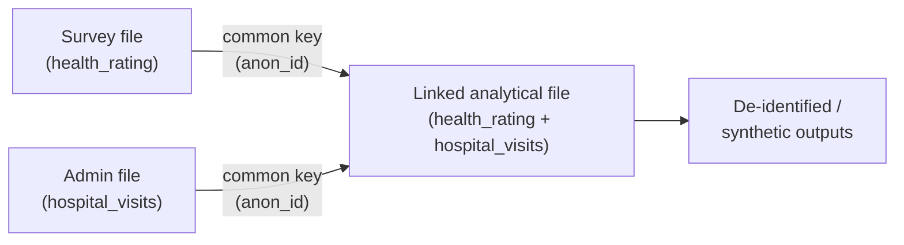
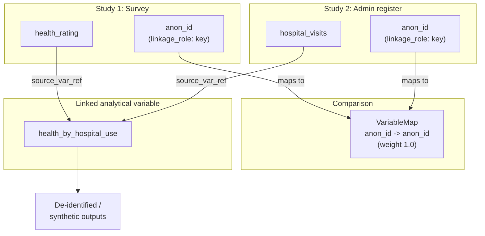

# Module 10: Data Linkage: Combining Records Across Datasets

!!! info "What you will learn"
    - Understand **microdata linkage**: combining records from two or more
      sources that describe the same person, household, or business.
    - See why **national statistical offices (NSOs)** and **academics** link
      data: to enrich datasets and reduce respondent burden without collecting
      anything new.
    - Model each **source dataset** as its own `StudyUnit` inside a group.
    - Identify and tag the **linkage keys** (the common variables that connect
      the sources) with custom properties.
    - Distinguish **deterministic** from **probabilistic** linkage.
    - Use a `Comparison` with **variable maps** to record how the common keys
      correspond across sources.
    - Record **cross-source provenance** on linked (analytical) variables with
      `source_variable_references`.
    - Capture **confidentiality and governance** metadata: de-identification,
      synthetic files, and approval status.

**Prerequisites:** [Module 9: Data Lineage](module-09-data-lineage.md).

**Time:** 60 min self-paced / 75 min instructor-led.

---

## 1. What is data linkage?

**Data linkage** (also called **microdata linkage** or **record linkage**)
is the process of combining records from two or more files that refer to the
**same unit**: an individual, a household, or a business.

Statistics Canada describes it this way:

!!! quote "Statistics Canada: Microdata linkage"
    Microdata linkage is an internationally recognized statistical method that
    maximizes the use of existing information by linking different files and
    variables to create new information. [...] We first link the different data
    records by using the variables they have in common. In order to protect
    confidentiality, all personal information is removed, so that the linked
    files are anonymized, or de-identified.

The key idea: instead of running a new survey to collect a variable, you
**link** an existing survey to an existing administrative file and reuse what
is already there.



## 2. Why NSOs and academics link data

| Who | Typical linkage | Why |
| --- | --- | --- |
| **NSO** | Survey → tax/administrative records | Add income without re-asking; reduce burden |
| **NSO** | Census → health/education registers | Study outcomes across domains |
| **NSO** | Same respondents across waves | Build a longitudinal file |
| **Academic** | Survey → hospital admissions | Research health outcomes |
| **Academic** | Birth records → school records | Study life-course trajectories |

Statistics Canada runs dedicated linkage environments (the **Social Data
Linkage Environment (SDLE)**, the **Business – Linkable File Environment
(B-LFE)**, and the **Longitudinal Employee and Business Analytical Files
(LEBAF)**) precisely to build **linked analytical files without collecting
additional data** from Canadians.

For a researcher, the payoff is the same: linkage turns two narrow files into
one rich file that can answer questions neither file could answer alone.

## 3. Two ways to link: deterministic and probabilistic

| Method | How it matches | When to use |
| --- | --- | --- |
| **Deterministic** | Exact match on a unique **key** (e.g. an anonymized ID) | A reliable common identifier exists |
| **Probabilistic** | Weighted agreement across several **quasi-identifiers** (name, date of birth, sex, postal code) with a decision threshold | No single reliable key; some fields have errors or missing values |

Deterministic linkage is simpler and is what we model in detail below.
Probabilistic linkage records the same structure but adds an agreement
**weight** and marks several **matching** variables rather than one key.

## 4. Our running example

We will link two files from a health study:

!!! example "Two source files"

    **Survey file**: collected from respondents.

    | anon_id | age | health_rating |
    |---|---|---|
    | A17 | 34 | Good |
    | A22 | 68 | Excellent |
    | A31 | 17 | Fair |

    **Administrative file**: hospital admissions register.

    | anon_id | hospital_visits | last_admission |
    |---|---|---|
    | A17 | 2 | 2021-03 |
    | A22 | 5 | 2021-07 |
    | A31 | 0 | |

    Both files share the column **`anon_id`**, an anonymized linkage key. That
    common variable is what lets us join a respondent's `health_rating` to their
    `hospital_visits` to create a **linked analytical file**.

## 5. Model each source as its own study

In DDI, each source dataset is its own `StudyUnit`. When you add a second
study, `ddi-l` automatically wraps both in a **group** (a study series). The
first study is the survey; we add the administrative register as a second study.

```python
import ddi_l as ddi
from ddi_l.models.base import Reference

# Source 1: the survey (the primary study)
doc = ddi.new_study(
    title="Canadian Community Health Survey 2021",
    agency="statcan.gc.ca",
)
q_key = doc.add_question(text="Anonymized linkage key")
q_health = doc.add_question(text="How would you rate your general health?")

survey_key = doc.add_variable(name="anon_id", question=q_key)
survey_health = doc.add_variable(name="health_rating", question=q_health)

print(f"Survey variables: {len(doc.variables)}")
# -> Survey variables: 2
```

Now add the administrative register as a **second study** and target it with a
[study cursor](../user-guide.md):

```python
# Source 2: the administrative register (a second study in the group)
admin = doc.add_study(title="Hospital Admissions Register 2021")
admin_ds = doc.study(admin.identifier)

admin_key = admin_ds.add_variable(name="anon_id")
admin_visits = admin_ds.add_variable(name="hospital_visits")
```

!!! note "Where do the counts live?"
    `doc.variables` counts variables in the **primary** study only. The
    administrative register's variables live in its own study unit, reached
    through the cursor `doc.study(admin.identifier)`. This mirrors reality:
    each source file is a separate, independently maintained dataset.

## 6. Tag the linkage keys

The **linkage key** is the common variable that connects the sources. Mark it
on both sides with a custom property so anyone reading the metadata knows which
variable does the joining.

Tag **both** sides:

```python
survey_key.set_property("linkage_role", "key")
admin_key.set_property("linkage_role", "key")

print(survey_key.get_property("linkage_role"))
# -> key
```

For **probabilistic** linkage you would instead tag several variables as
`"matching"` (e.g. `date_of_birth`, `sex`, `postal_code`) and, optionally, the
ones used to group candidate pairs as `"blocking"`.

## 7. Record how the keys correspond: a Comparison

A `Comparison` is DDI's container for recording how items in different studies
**correspond**. Add a **variable map** from the survey key to the admin key,
and describe the match quality with a **correspondence**.

```python
cmp = doc.add_comparison(name="Survey-to-Admin Microdata Linkage 2021")

# Describe the match: full commonality (weight 1.0) for an exact key
key_match = cmp.correspondence(
    commonality="Anonymized personal identifier common to both sources.",
    weight=1.0,
)

cmp.add_variable_map(
    survey_key.to_reference(),
    admin_key.to_reference(),
    correspondence=key_match,
)

print(f"Comparisons: {len(doc.comparisons)}")
# -> Comparisons: 1
```

For probabilistic linkage, set `weight` below `1.0` to record that agreement
is partial, and add a variable map for each matching variable.

## 8. Record the linkage method and quality

Store the linkage **method** and **quality indicators** as custom properties on
the comparison. These are exactly the facts an auditor, a data steward, or a
future researcher will ask for.

```python
cmp.set_property("linkage_method", "deterministic")
cmp.set_property("match_rate", "0.94")
cmp.set_property("false_match_rate", "0.01")
cmp.set_property("approval", "Directive on Microdata Linkage - pre-approved")

print(cmp.get_property("linkage_method"))
# -> deterministic
```

## 9. Build the linked variable with cross-source provenance

The **linked analytical file** holds variables drawn from *both* sources. Each
linked variable records where it came from with `source_variable_references`,
just like a derived variable in [Module 9](module-09-data-lineage.md), except
now the sources sit in **different studies**.

```python
linked = doc.add_variable(name="health_by_hospital_use")
linked.source_variable_references = [
    Reference(
        agency="statcan.gc.ca",
        identifier=survey_health.identifier,
        version="1",
    ),
    Reference(
        agency="statcan.gc.ca",
        identifier=admin_visits.identifier,
        version="1",
    ),
]

print(f"Linked variable sources: {len(linked.source_variable_references)}")
# -> Linked variable sources: 2
```

!!! warning "Cross-study references warn on save"
    When you save, `ddi-l` may print a `UserWarning` that a
    `source_variable_reference` is "not present in the current document." That
    is **expected** for linkage: the source variable lives in a *different*
    study within the group. The reference is still written correctly: it is a
    full cross-study link, which is the whole point of data linkage.

## 10. Record confidentiality and governance

Microdata linkage is governed by strict privacy rules. Statistics Canada's
**Directive on Microdata Linkage** requires that the public value of a linkage
outweigh any intrusion on privacy, and that personal identifiers be removed so
the linked file is **de-identified**. Researchers often work with **synthetic**
versions rather than the original records.

Record this governance context as custom properties so it travels with the
metadata:

```python
study = doc.study_unit
study.set_property(
    "confidentiality",
    "de-identified; synthetic file for researcher access",
)
study.set_property("governance", "Directive on Microdata Linkage")

print(study.get_property("confidentiality"))
# -> de-identified; synthetic file for researcher access
```

## 11. Save the linkage document

```python
doc.save("health-linkage-2021.xml")
```

The saved file records, in one place: both source studies, the linkage key on
each side, the comparison that maps the keys, the linkage method and quality,
the linked variable's provenance to both sources, and the confidentiality and
governance context.

## 12. The complete linkage model



Every arrow is a `Reference` in DDI. Reading the model, anyone can see which
variable joined the files, how good the match was, and where every value in the
linked file came from.

---

!!! example "Scenario"
    You are documenting a microdata linkage at an NSO. A health survey and a
    hospital admissions register share an anonymized identifier, `anon_id`. You
    link them deterministically to study health outcomes against hospital use.
    You must record: the two source datasets, the linkage key on each side, the
    map between the keys, the linkage method and match rate, the provenance of
    the linked variable back to both sources, and the fact that the released
    file is de-identified under the Directive on Microdata Linkage.

---

## Exercises

1. Create the survey study with two variables (`anon_id`, `health_rating`).
   Tag `anon_id` as the linkage key. Print the variable count and the key's
   `linkage_role`.

    **Expected output:**

    ```text
    Survey variables: 2
    anon_id linkage_role: key
    ```

2. Add the administrative register as a second study with two variables
   (`anon_id`, `hospital_visits`). Tag its `anon_id` as a key. Then add a
   `Comparison` that maps the survey key to the admin key with a correspondence
   weight of `1.0`. Print the comparison count.

    **Expected output:**

    ```text
    Comparisons: 1
    ```

3. Record the linkage method (`deterministic`) and a `match_rate` of `0.94` as
   properties on the comparison. Print the method back.

    **Expected output:**

    ```text
    deterministic
    ```

4. Create a linked variable `health_by_hospital_use` with
   `source_variable_references` pointing to **both** `health_rating` (survey)
   and `hospital_visits` (admin). Print how many sources it has.

    **Expected output:**

    ```text
    Linked variable sources: 2
    ```

5. (Bonus) Model a **probabilistic** linkage instead: tag three variables
   (`date_of_birth`, `sex`, `postal_code`) with `linkage_role="matching"`, and
   set the comparison's correspondence `weight` to `0.85`. Verify each variable
   reports `matching` for its `linkage_role`.

---

## Quiz

???+ question "Q1: What is data linkage?"
    **A.** Deleting duplicate rows from one file.

    **B.** Combining records from two or more sources that refer to the same unit.

    **C.** Translating a variable from English to French.

    **D.** Validating a file against the DDI schema.

    ??? success "Answer"
        **B.** Data (microdata) linkage combines records from different files
        that describe the same person, household, or business, using the
        variables they have in common.

???+ question "Q2: What is the linkage key?"
    **A.** The password that unlocks the file.

    **B.** The variable common to both sources that connects matching records.

    **C.** The largest variable in the file.

    **D.** The version number of the study.

    ??? success "Answer"
        **B.** The linkage key is the common variable (here, `anon_id`) used to
        join records that belong to the same unit. We tag it with
        `set_property("linkage_role", "key")`.

???+ question "Q3: How does deterministic linkage differ from probabilistic linkage?"
    **A.** Deterministic matches on an exact key; probabilistic weighs agreement across several quasi-identifiers.

    **B.** Deterministic is only for businesses; probabilistic is only for people.

    **C.** They are two names for the same method.

    **D.** Probabilistic requires no matching variables at all.

    ??? success "Answer"
        **A.** Deterministic linkage matches on a reliable exact key.
        Probabilistic linkage combines weighted agreement across several
        fields (name, date of birth, sex, postal code) and applies a threshold.

???+ question "Q4: How do you record that a linked variable draws on two source files?"
    **A.** Set `question=` twice.

    **B.** Put both sources in `source_variable_references`.

    **C.** Rename the variable.

    **D.** Increase the version number.

    ??? success "Answer"
        **B.** `source_variable_references` holds a `Reference` to each source
        variable (here, one to the survey variable and one to the admin
        variable), even though they live in different studies.

???+ question "Q5: Why does the linked file get de-identified?"
    **A.** To make the file smaller.

    **B.** To protect confidentiality. Personal identifiers are removed so the linked file is anonymized.

    **C.** Because DDI forbids names.

    **D.** To speed up validation.

    ??? success "Answer"
        **B.** Under governance such as Statistics Canada's Directive on
        Microdata Linkage, personal information is removed so the linked file
        is de-identified; researchers often access synthetic versions instead
        of the original records.

---

!!! tip "Instructor notes"
    - Anchor the concept with the burden argument: "Why ask people their income
      on a survey if the tax file already has it? Link instead." Linkage reuses
      existing data to create new information.
    - Draw two file icons sharing one column (`anon_id`). The shared column is
      the key. Everything else in the module hangs off that picture.
    - Contrast the two data-quality regimes: deterministic (one reliable key,
      weight 1.0) vs probabilistic (several noisy fields, weight < 1.0,
      clerical review). Ask which fits a file with typos in names.
    - Emphasize that `source_variable_references` crossing study boundaries is
      the technical heart of linkage, and that the save-time warning is
      expected, not an error.
    - For NSO staff: connect to real infrastructure (SDLE, B-LFE, LEBAF) and
      to governance: pre-approved linkages vs those needing a documented
      proposal and review under the Directive on Microdata Linkage.
    - For academics: stress reproducibility. A reviewer must be able to see
      which key joined the files, the match rate, and the provenance of every
      linked variable. That is exactly what this metadata captures.
    - Privacy framing matters: every linkage the class models should end with
      de-identification and, often, synthetic data for access. Make that the
      last step, not an afterthought.

---

**See also:** [Module 9: Data Lineage](module-09-data-lineage.md) | [Module 11: Properties, Find, and Validate](module-11-properties-find-validate.md) | [User guide: Compare and harmonize studies](../user-guide.md)
