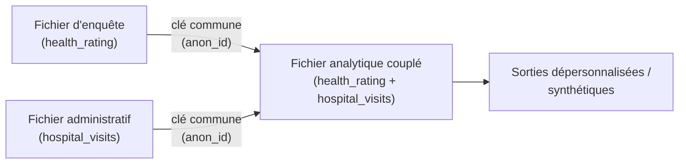
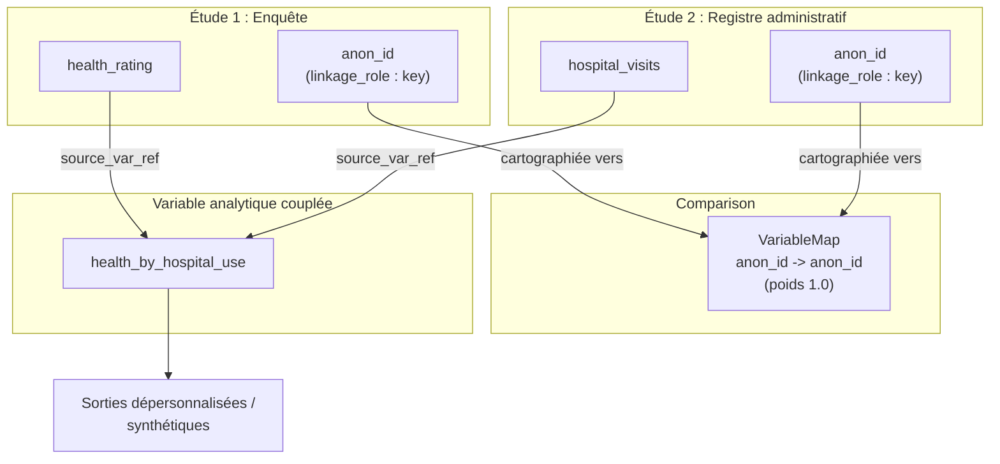

# Module 10 : Couplage de données : combiner des enregistrements entre jeux de données

!!! info "Ce que vous apprendrez"
    - Comprendre le **couplage de microdonnées** : combiner des enregistrements
      provenant de deux sources ou plus qui décrivent la même personne, le même
      ménage ou la même entreprise.
    - Voir pourquoi les **instituts nationaux de statistique (INS)** et les
      **universitaires** couplent des données : pour enrichir des jeux de données
      et réduire le fardeau des répondants sans rien collecter de nouveau.
    - Modéliser chaque **jeu de données source** comme son propre `StudyUnit` au
      sein d'un groupe.
    - Repérer et étiqueter les **clés de couplage** (les variables communes qui
      relient les sources) avec des propriétés personnalisées.
    - Distinguer le couplage **déterministe** du couplage **probabiliste**.
    - Utiliser une `Comparison` avec des **cartes de variables** pour enregistrer
      comment les clés communes se correspondent entre les sources.
    - Enregistrer la **provenance inter-sources** sur les variables couplées
      (analytiques) avec `source_variable_references`.
    - Consigner les métadonnées de **confidentialité et de gouvernance** :
      dépersonnalisation, fichiers synthétiques et statut d'approbation.

**Prérequis :** [Module 9 : Traçabilité des données](module-09-data-lineage.md).

**Durée :** 60 min en autonomie / 75 min avec instructeur.

---

## 1. Qu'est-ce que le couplage de données ?

Le **couplage de données** (aussi appelé **couplage de microdonnées** ou
**couplage d'enregistrements**) est le processus qui consiste à combiner des
enregistrements de deux fichiers ou plus qui se rapportent à la **même unité** :
un individu, un ménage ou une entreprise.

Statistique Canada le décrit ainsi :

!!! quote "Statistique Canada : Couplage de microdonnées"
    Le couplage de microdonnées est une méthode statistique reconnue à l'échelle
    internationale qui optimise l'utilisation des renseignements existants en
    couplant différents fichiers et variables afin de créer de nouveaux
    renseignements. [...] Nous couplons d'abord les différents enregistrements
    au moyen des variables qu'ils ont en commun. Afin de protéger la
    confidentialité, tous les renseignements personnels sont retirés, de sorte
    que les fichiers couplés sont anonymisés, ou dépersonnalisés.

L'idée clé : au lieu de mener une nouvelle enquête pour collecter une variable,
vous **couplez** une enquête existante à un fichier administratif existant et
réutilisez ce qui s'y trouve déjà.



## 2. Pourquoi les INS et les universitaires couplent des données

| Qui | Couplage typique | Pourquoi |
| --- | --- | --- |
| **INS** | Enquête → fichiers fiscaux/administratifs | Ajouter le revenu sans le redemander ; réduire le fardeau |
| **INS** | Recensement → registres de santé/d'éducation | Étudier les résultats entre domaines |
| **INS** | Mêmes répondants à travers les vagues | Bâtir un fichier longitudinal |
| **Universitaire** | Enquête → admissions hospitalières | Rechercher les résultats de santé |
| **Universitaire** | Registres de naissances → dossiers scolaires | Étudier les trajectoires de vie |

Statistique Canada exploite des environnements de couplage dédiés
(l'**Environnement de couplage de données sociales (ECDS / SDLE)**,
l'**Environnement de fichiers couplables des entreprises (B-LFE)** et les
**Fichiers analytiques longitudinaux des employés et des entreprises (LEBAF)**)
précisément pour bâtir des **fichiers analytiques couplés sans collecter de
données supplémentaires** auprès des Canadiens.

Pour un chercheur, le bénéfice est le même : le couplage transforme deux
fichiers étroits en un fichier riche capable de répondre à des questions
qu'aucun des deux ne pourrait résoudre seul.

## 3. Deux façons de coupler : déterministe et probabiliste

| Méthode | Comment elle apparie | Quand l'utiliser |
| --- | --- | --- |
| **Déterministe** | Appariement exact sur une **clé** unique (p. ex. un identifiant anonymisé) | Un identifiant commun fiable existe |
| **Probabiliste** | Accord pondéré sur plusieurs **quasi-identifiants** (nom, date de naissance, sexe, code postal) avec un seuil de décision | Aucune clé fiable unique ; certains champs comportent des erreurs ou des valeurs manquantes |

Le couplage déterministe est plus simple et c'est celui que nous modélisons en
détail ci-dessous. Le couplage probabiliste enregistre la même structure mais
ajoute un **poids** d'accord et marque plusieurs variables **d'appariement**
plutôt qu'une seule clé.

## 4. Notre exemple

Nous allons coupler deux fichiers d'une étude sur la santé :

!!! example "Deux fichiers sources"

    **Fichier d'enquête** : collecté auprès des répondants.

    | anon_id | age | health_rating |
    |---|---|---|
    | A17 | 34 | Good |
    | A22 | 68 | Excellent |
    | A31 | 17 | Fair |

    **Fichier administratif** : registre des admissions hospitalières.

    | anon_id | hospital_visits | last_admission |
    |---|---|---|
    | A17 | 2 | 2021-03 |
    | A22 | 5 | 2021-07 |
    | A31 | 0 | |

    Les deux fichiers partagent la colonne **`anon_id`**, une clé de couplage
    anonymisée. Cette variable commune nous permet de joindre le `health_rating`
    d'un répondant à ses `hospital_visits` pour créer un **fichier analytique
    couplé**.

## 5. Modéliser chaque source comme sa propre étude

En DDI, chaque jeu de données source est son propre `StudyUnit`. Quand vous
ajoutez une deuxième étude, `ddi-l` enveloppe automatiquement les deux dans un
**groupe** (une série d'études). La première étude est l'enquête ; nous ajoutons
le registre administratif comme deuxième étude.

```python
import ddi_l as ddi
from ddi_l.models.base import Reference

# Source 1 : l'enquête (l'étude primaire)
doc = ddi.new_study(
    title="Canadian Community Health Survey 2021",
    agency="statcan.gc.ca",
)
q_key = doc.add_question(text="Anonymized linkage key")
q_health = doc.add_question(text="How would you rate your general health?")

survey_key = doc.add_variable(name="anon_id", question=q_key)
survey_health = doc.add_variable(name="health_rating", question=q_health)

print(f"Survey variables: {len(doc.variables)}")
# -> Survey variables: 2
```

Ajoutez maintenant le registre administratif comme **deuxième étude** et
ciblez-le avec un [curseur d'étude](../user-guide.md) :

```python
# Source 2 : le registre administratif (une deuxième étude du groupe)
admin = doc.add_study(title="Hospital Admissions Register 2021")
admin_ds = doc.study(admin.identifier)

admin_key = admin_ds.add_variable(name="anon_id")
admin_visits = admin_ds.add_variable(name="hospital_visits")
```

!!! note "Où vivent les compteurs ?"
    `doc.variables` ne compte que les variables de l'étude **primaire**. Les
    variables du registre administratif vivent dans leur propre unité d'étude,
    accessible via le curseur `doc.study(admin.identifier)`. Cela reflète la
    réalité : chaque fichier source est un jeu de données distinct, maintenu
    indépendamment.

## 6. Étiqueter les clés de couplage

La **clé de couplage** est la variable commune qui relie les sources.
Marquez-la des deux côtés avec une propriété personnalisée afin que quiconque
lit les métadonnées sache quelle variable réalise la jointure.

Étiquetez les **deux** côtés :

```python
survey_key.set_property("linkage_role", "key")
admin_key.set_property("linkage_role", "key")

print(survey_key.get_property("linkage_role"))
# -> key
```

Pour un couplage **probabiliste**, vous étiquetteriez plutôt plusieurs variables
comme `"matching"` (p. ex. `date_of_birth`, `sex`, `postal_code`) et,
facultativement, celles servant à regrouper les paires candidates comme
`"blocking"`.

## 7. Enregistrer la correspondance des clés : une Comparison

Une `Comparison` est le conteneur DDI qui enregistre comment des éléments de
différentes études se **correspondent**. Ajoutez une **carte de variables** de
la clé d'enquête vers la clé administrative, et décrivez la qualité de
l'appariement avec une **correspondance**.

```python
cmp = doc.add_comparison(name="Survey-to-Admin Microdata Linkage 2021")

# Décrire l'appariement : communauté totale (poids 1.0) pour une clé exacte
key_match = cmp.correspondence(
    commonality="Anonymized personal identifier common to both sources.",
    weight=1.0,
)

cmp.add_variable_map(
    survey_key.to_reference(),
    admin_key.to_reference(),
    correspondence=key_match,
)

print(f"Comparisons: {len(doc.comparisons)}")
# -> Comparisons: 1
```

Pour un couplage probabiliste, fixez `weight` sous `1.0` pour enregistrer que
l'accord est partiel, et ajoutez une carte de variables pour chaque variable
d'appariement.

## 8. Enregistrer la méthode et la qualité du couplage

Stockez la **méthode** de couplage et les **indicateurs de qualité** comme
propriétés personnalisées sur la comparaison. Ce sont exactement les faits qu'un
auditeur, un gestionnaire de données ou un futur chercheur demandera.

```python
cmp.set_property("linkage_method", "deterministic")
cmp.set_property("match_rate", "0.94")
cmp.set_property("false_match_rate", "0.01")
cmp.set_property("approval", "Directive on Microdata Linkage - pre-approved")

print(cmp.get_property("linkage_method"))
# -> deterministic
```

## 9. Construire la variable couplée avec une provenance inter-sources

Le **fichier analytique couplé** contient des variables tirées des *deux*
sources. Chaque variable couplée enregistre son origine avec
`source_variable_references`, comme une variable dérivée du
[Module 9](module-09-data-lineage.md), sauf que maintenant les sources se
trouvent dans des **études différentes**.

```python
linked = doc.add_variable(name="health_by_hospital_use")
linked.source_variable_references = [
    Reference(
        agency="statcan.gc.ca",
        identifier=survey_health.identifier,
        version="1",
    ),
    Reference(
        agency="statcan.gc.ca",
        identifier=admin_visits.identifier,
        version="1",
    ),
]

print(f"Linked variable sources: {len(linked.source_variable_references)}")
# -> Linked variable sources: 2
```

!!! warning "Les références inter-études émettent un avertissement à l'enregistrement"
    À l'enregistrement, `ddi-l` peut afficher un `UserWarning` indiquant qu'une
    `source_variable_reference` est « absente du document courant ». C'est
    **attendu** pour le couplage : la variable source vit dans une étude
    *différente* au sein du groupe. La référence est tout de même écrite
    correctement : c'est un lien inter-études complet, ce qui est précisément le
    but du couplage de données.

## 10. Consigner la confidentialité et la gouvernance

Le couplage de microdonnées est régi par des règles de protection de la vie
privée strictes. La **Directive sur le couplage de microdonnées** de Statistique
Canada exige que la valeur publique d'un couplage l'emporte sur toute atteinte à
la vie privée, et que les identifiants personnels soient retirés pour que le
fichier couplé soit **dépersonnalisé**. Les chercheurs travaillent souvent avec
des versions **synthétiques** plutôt qu'avec les enregistrements originaux.

Consignez ce contexte de gouvernance comme propriétés personnalisées afin qu'il
accompagne les métadonnées :

```python
study = doc.study_unit
study.set_property(
    "confidentiality",
    "de-identified; synthetic file for researcher access",
)
study.set_property("governance", "Directive on Microdata Linkage")

print(study.get_property("confidentiality"))
# -> de-identified; synthetic file for researcher access
```

## 11. Enregistrer le document de couplage

```python
doc.save("health-linkage-2021.xml")
```

Le fichier enregistré consigne, en un seul endroit : les deux études sources, la
clé de couplage de chaque côté, la comparaison qui cartographie les clés, la
méthode et la qualité du couplage, la provenance de la variable couplée vers les
deux sources, ainsi que le contexte de confidentialité et de gouvernance.

## 12. Le modèle complet de couplage



Chaque flèche est une `Reference` en DDI. En lisant le modèle, quiconque peut
voir quelle variable a joint les fichiers, la qualité de l'appariement, et
d'où vient chaque valeur du fichier couplé.

---

!!! example "Scénario"
    Vous documentez un couplage de microdonnées dans un INS. Une enquête sur la
    santé et un registre des admissions hospitalières partagent un identifiant
    anonymisé, `anon_id`. Vous les couplez de façon déterministe pour étudier
    les résultats de santé au regard de l'utilisation hospitalière. Vous devez
    enregistrer : les deux jeux de données sources, la clé de couplage de chaque
    côté, la carte entre les clés, la méthode et le taux d'appariement, la
    provenance de la variable couplée vers les deux sources, et le fait que le
    fichier diffusé est dépersonnalisé en vertu de la Directive sur le couplage
    de microdonnées.

---

## Exercices

1. Créez l'étude d'enquête avec deux variables (`anon_id`, `health_rating`).
   Étiquetez `anon_id` comme clé de couplage. Affichez le compteur de variables
   et le `linkage_role` de la clé.

    **Résultat attendu :**

    ```text
    Survey variables: 2
    anon_id linkage_role: key
    ```

2. Ajoutez le registre administratif comme deuxième étude avec deux variables
   (`anon_id`, `hospital_visits`). Étiquetez son `anon_id` comme clé. Puis
   ajoutez une `Comparison` qui cartographie la clé d'enquête vers la clé
   administrative avec un poids de correspondance de `1.0`. Affichez le compteur
   de comparaisons.

    **Résultat attendu :**

    ```text
    Comparisons: 1
    ```

3. Enregistrez la méthode de couplage (`deterministic`) et un `match_rate` de
   `0.94` comme propriétés sur la comparaison. Affichez la méthode.

    **Résultat attendu :**

    ```text
    deterministic
    ```

4. Créez une variable couplée `health_by_hospital_use` avec
   `source_variable_references` pointant vers **les deux** `health_rating`
   (enquête) et `hospital_visits` (administratif). Affichez le nombre de sources.

    **Résultat attendu :**

    ```text
    Linked variable sources: 2
    ```

5. (Bonus) Modélisez plutôt un couplage **probabiliste** : étiquetez trois
   variables (`date_of_birth`, `sex`, `postal_code`) avec
   `linkage_role="matching"`, et fixez le `weight` de la correspondance de la
   comparaison à `0.85`. Vérifiez que chaque variable rapporte `matching` pour
   son `linkage_role`.

---

## Quiz

???+ question "Question 1 : Qu'est-ce que le couplage de données ?"
    **A.** Supprimer les lignes en double d'un fichier.

    **B.** Combiner des enregistrements de deux sources ou plus qui se rapportent à la même unité.

    **C.** Traduire une variable de l'anglais au français.

    **D.** Valider un fichier par rapport au schéma DDI.

    ??? success "Réponse"
        **B.** Le couplage de (micro)données combine des enregistrements de
        différents fichiers qui décrivent la même personne, le même ménage ou
        la même entreprise, au moyen des variables qu'ils ont en commun.

???+ question "Question 2 : Qu'est-ce que la clé de couplage ?"
    **A.** Le mot de passe qui déverrouille le fichier.

    **B.** La variable commune aux deux sources qui relie les enregistrements appariés.

    **C.** La plus grande variable du fichier.

    **D.** Le numéro de version de l'étude.

    ??? success "Réponse"
        **B.** La clé de couplage est la variable commune (ici, `anon_id`)
        utilisée pour joindre les enregistrements appartenant à la même unité.
        Nous l'étiquetons avec `set_property("linkage_role", "key")`.

???+ question "Question 3 : En quoi le couplage déterministe diffère-t-il du couplage probabiliste ?"
    **A.** Le déterministe apparie sur une clé exacte ; le probabiliste pondère l'accord sur plusieurs quasi-identifiants.

    **B.** Le déterministe ne concerne que les entreprises ; le probabiliste ne concerne que les personnes.

    **C.** Ce sont deux noms pour la même méthode.

    **D.** Le probabiliste ne nécessite aucune variable d'appariement.

    ??? success "Réponse"
        **A.** Le couplage déterministe apparie sur une clé exacte fiable. Le
        couplage probabiliste combine un accord pondéré sur plusieurs champs
        (nom, date de naissance, sexe, code postal) et applique un seuil.

???+ question "Question 4 : Comment enregistrer qu'une variable couplée s'appuie sur deux fichiers sources ?"
    **A.** Définir `question=` deux fois.

    **B.** Mettre les deux sources dans `source_variable_references`.

    **C.** Renommer la variable.

    **D.** Augmenter le numéro de version.

    ??? success "Réponse"
        **B.** `source_variable_references` contient une `Reference` vers chaque
        variable source (ici, une vers la variable d'enquête et une vers la
        variable administrative), même si elles vivent dans des études
        différentes.

???+ question "Question 5 : Pourquoi le fichier couplé est-il dépersonnalisé ?"
    **A.** Pour réduire la taille du fichier.

    **B.** Pour protéger la confidentialité. Les identifiants personnels sont retirés pour que le fichier couplé soit anonymisé.

    **C.** Parce que DDI interdit les noms.

    **D.** Pour accélérer la validation.

    ??? success "Réponse"
        **B.** En vertu d'une gouvernance telle que la Directive sur le couplage
        de microdonnées de Statistique Canada, les renseignements personnels
        sont retirés pour que le fichier couplé soit dépersonnalisé ; les
        chercheurs accèdent souvent à des versions synthétiques plutôt qu'aux
        enregistrements originaux.

---

!!! tip "Notes pour l'instructeur"
    - Ancrez le concept avec l'argument du fardeau : « Pourquoi demander leur
      revenu aux gens dans une enquête si le fichier fiscal l'a déjà ?
      Couplez plutôt. » Le couplage réutilise des données existantes pour créer
      de nouveaux renseignements.
    - Dessinez deux icônes de fichiers partageant une colonne (`anon_id`). La
      colonne partagée est la clé. Tout le reste du module découle de cette image.
    - Opposez les deux régimes de qualité : déterministe (une clé fiable unique,
      poids 1.0) vs probabiliste (plusieurs champs bruités, poids < 1.0, révision
      manuelle). Demandez lequel convient à un fichier comportant des fautes de
      frappe dans les noms.
    - Soulignez que `source_variable_references` traversant les frontières
      d'étude est le cœur technique du couplage, et que l'avertissement à
      l'enregistrement est attendu, pas une erreur.
    - Pour le personnel des INS : reliez à l'infrastructure réelle (ECDS/SDLE,
      B-LFE, LEBAF) et à la gouvernance : couplages pré-approuvés vs ceux
      nécessitant une proposition documentée et un examen en vertu de la
      Directive sur le couplage de microdonnées.
    - Pour les universitaires : insistez sur la reproductibilité. Un évaluateur
      doit pouvoir voir quelle clé a joint les fichiers, le taux d'appariement et
      la provenance de chaque variable couplée. C'est exactement ce que ces
      métadonnées capturent.
    - Le cadrage de la vie privée compte : chaque couplage modélisé en classe
      devrait se terminer par une dépersonnalisation et, souvent, des données
      synthétiques pour l'accès. Faites-en la dernière étape, pas une réflexion
      après coup.

---

**Voir aussi :** [Module 9 : Traçabilité des données](module-09-data-lineage.md) | [Module 11 : Propriétés, recherche et validation](module-11-properties-find-validate.md) | [Guide utilisateur : Comparer et harmoniser des études](../user-guide.md)
