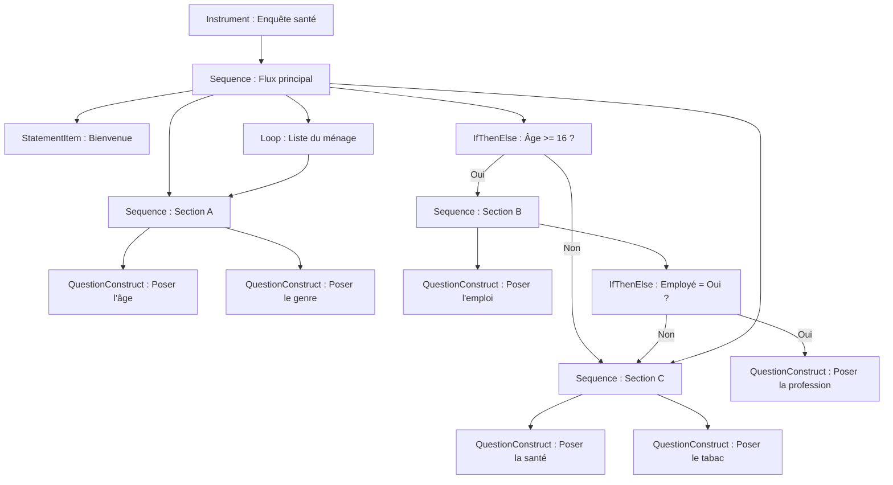

# Module 10 : Traduire un devis de questionnaire en logique de flux DDI

!!! info "Ce que vous apprendrez"
    - Lire un devis de questionnaire papier et identifier sa logique de flux.
    - Associer chaque partie du devis à une **construction de contrôle** DDI : `Sequence`, `QuestionConstruct`, `IfThenElse`, `StatementItem`.
    - Construire des sauts conditionnels avec `IfThenElse` et `ElseIf`.
    - Comprendre comment DDI représente les boucles pour les listes de ménage et les sections répétées.
    - Connecter un `Instrument` à une `Sequence` principale.

**Prérequis :** [Module 9 : Listes de codes](module-09-code-lists.md).

**Durée :** 50 min en autonomie / 60 min avec instructeur.

---

## 1. Du papier au DDI

La plupart des questionnaires commencent par un devis écrit.
Le devis liste les questions dans l'ordre et décrit les **sauts conditionnels** : des règles comme « Si le répondant a moins de 18 ans, passer à la section C. »

Votre travail est de transformer ce devis en métadonnées DDI pour que la logique de flux soit lisible par une machine.
Ce module vous apprend comment faire.

## 2. Un exemple de devis de questionnaire

Voici un devis simple d'enquête sur la santé.
Lisez-le attentivement ; nous allons associer chaque partie au DDI.

!!! example "Devis de l'enquête sur la santé"

    **Section A : Démographie**

    - A1. Quel est votre âge ? *(numérique)*
    - A2. Quel est votre genre ? *(liste de codes : Male, Female, Other)*

    **Section B : Emploi** *(sauter si âge < 16)*

    - B1. Êtes-vous actuellement employé ? *(Oui / Non)*
    - B2. Quelle est votre profession ? *(texte, poser seulement si B1 = Oui)*

    **Section C : Santé**

    - C1. Comment évaluez-vous votre santé générale ? *(liste de codes : Excellent, Good, Fair, Poor)*
    - C2. Fumez-vous ? *(Oui / Non)*

    **Liste du ménage** *(répéter la section A pour chaque membre du ménage)*

## 3. Les éléments de base du DDI

Chaque partie du devis correspond à une **construction de contrôle** DDI :

| Élément du devis | Construction DDI | Ce qu'elle fait |
| --- | --- | --- |
| Introduction de section | `StatementItem` | Affiche du texte sans poser de question |
| Une question | `QuestionConstruct` | Pose une question |
| Une section ordonnée | `Sequence` | Regroupe des étapes dans l'ordre |
| « Sauter si... » | `IfThenElse` | Branche selon une condition |
| « Poser seulement si... » | `IfThenElse` | Même chose ; la condition décide du chemin |
| « Répéter pour chaque... » | `Loop` | Répète une section pour une liste d'éléments |
| Le questionnaire complet | `Instrument` | Pointe vers la Sequence principale |

Tous ces éléments se trouvent dans le module `ddi_l.models.datacollection` :

```python
from ddi_l.models.datacollection import (
    Instrument,
    Sequence,
    QuestionConstruct,
    IfThenElse,
    ElseIf,
    StatementItem,
)
```

!!! tip "Deux choses à retenir"
    - Vous créez chaque construction avec le même appel
      `doc.add_item(<Type>, name="...")` que vous utilisez déjà pour les
      questions et les variables.
    - Vous **reliez** les constructions entre elles avec `.to_reference()`.
      Une référence dit « cette construction pointe vers celle-là ». Elle
      porte l'identifiant et le type de la cible pour que le fichier reste
      valide.

## 4. Étape 1 : Créer l'étude et les questions

D'abord, créez l'étude et toutes les questions du devis.
Chaque question devient un élément de question DDI.

```python
import ddi_l as ddi

doc = ddi.new_study(title="National Health Survey", agency="health.gc.ca")

# Section A
q_age = doc.add_question(text="What is your age?")
q_gender = doc.add_question(text="What is your gender?")

# Section B
q_employed = doc.add_question(text="Are you currently employed?")
q_occupation = doc.add_question(text="What is your occupation?")

# Section C
q_health = doc.add_question(text="How would you rate your general health?")
q_smoke = doc.add_question(text="Do you smoke?")

print(f"Questions: {len(doc.questions)}")  # -> Questions: 6
```

## 5. Étape 2 : Créer les QuestionConstructs

Un **QuestionConstruct** enveloppe une question pour qu'elle puisse être placée dans une Sequence.
Pensez-y comme l'instruction « maintenant, posez cette question ».

Ajoutez-en un pour chaque question et pointez-le vers la question avec
`.to_reference()` :

```python
qc_age = doc.add_item(
    QuestionConstruct, name="Ask Age", question_reference=q_age.to_reference()
)
qc_gender = doc.add_item(
    QuestionConstruct, name="Ask Gender", question_reference=q_gender.to_reference()
)
qc_employed = doc.add_item(
    QuestionConstruct, name="Ask Employed", question_reference=q_employed.to_reference()
)
qc_occupation = doc.add_item(
    QuestionConstruct,
    name="Ask Occupation",
    question_reference=q_occupation.to_reference(),
)
qc_health = doc.add_item(
    QuestionConstruct,
    name="Ask Health Rating",
    question_reference=q_health.to_reference(),
)
qc_smoke = doc.add_item(
    QuestionConstruct, name="Ask Smoke", question_reference=q_smoke.to_reference()
)

print(f"QuestionConstructs: {len(doc.items(QuestionConstruct))}")
# -> QuestionConstructs: 6
```

## 6. Étape 3 : Construire les Sequences de chaque section

Le devis a trois sections (A, B, C).
Chaque section devient une `Sequence` qui liste ses étapes dans l'ordre. Vous
listez les étapes avec `control_construct_references`, une référence par
étape :

```python
seq_demographics = doc.add_item(
    Sequence,
    name="Section A - Demographics",
    control_construct_references=[qc_age.to_reference(), qc_gender.to_reference()],
)
seq_employment = doc.add_item(
    Sequence,
    name="Section B - Employment",
    control_construct_references=[qc_employed.to_reference()],
)
seq_health = doc.add_item(
    Sequence,
    name="Section C - Health",
    control_construct_references=[qc_health.to_reference(), qc_smoke.to_reference()],
)
```

Vous pouvez aussi ajouter un **StatementItem** pour introduire une section.
Il affiche un message au lieu de poser une question :

```python
intro_a = doc.add_item(StatementItem, name="Welcome to the National Health Survey")
```

## 7. Étape 4 : Modéliser les sauts conditionnels avec IfThenElse

Le devis dit : *« Sauter la section B si âge < 16. »*
En DDI, cela devient une construction `IfThenElse`.

Un `IfThenElse` a trois parties :

- **Condition Si** : la règle à vérifier (âge >= 16)
- **Alors** : quelle construction exécuter si vrai (Section B)
- **Sinon** : quelle construction exécuter si faux (passer à la Section C)

Créez-le avec `add_item()`, définissez la règle avec `set_condition()`, puis
connectez les branches avec `.to_reference()` :

```python
skip_employment = doc.add_item(IfThenElse, name="Age gate for employment")
skip_employment.set_condition("age >= 16", description="Working age")
skip_employment.then_construct_reference = seq_employment.to_reference()
skip_employment.else_construct_reference = seq_health.to_reference()
```

Pour un routage à plusieurs voies (« si 16-64 poser l'emploi, si 65+ poser la
retraite »), ajoutez des branches `ElseIf` avec `add_elseif()` :

```python
seq_retirement = doc.add_item(
    Sequence,
    name="Section B2 - Retraite",
    control_construct_references=[qc_employed.to_reference()],
)

skip_employment.add_elseif(seq_retirement.to_reference(), command="age >= 65")
```

## 8. Étape 5 : Modéliser « poser seulement si » avec un IfThenElse imbriqué

Le devis dit : *« Poser B2 (profession) seulement si B1 = Oui. »*
C'est un autre `IfThenElse`, cette fois à l'intérieur de la Section B.
Le chemin « alors » exécute le QuestionConstruct de la profession ; le chemin
« sinon » est laissé vide, donc la question est sautée :

```python
ask_occupation = doc.add_item(IfThenElse, name="Occupation routing")
ask_occupation.then_construct_reference = qc_occupation.to_reference()
```

## 9. Étape 6 : Modéliser une liste de ménage avec Loop

Le devis dit : *« Répéter la section A pour chaque membre du ménage. »*
DDI représente cela avec une construction **Loop**.

Un Loop répète une construction de contrôle (habituellement une Sequence)
pour chaque élément d'une liste. Par exemple, il exécute la section
démographique une fois par membre du ménage. Ajoutez-le comme toute autre
construction et pointez-le vers la section qu'il répète avec
`control_construct_reference` :

```python
from ddi_l.models.datacollection import Loop

roster_loop = doc.add_item(Loop, name="Household roster loop")
roster_loop.control_construct_reference = seq_demographics.to_reference()
```

## 10. Étape 7 : Construire la Sequence principale et l'Instrument

La **Sequence principale** définit le flux global du questionnaire.
Elle référence les séquences de section, les portes IfThenElse et la boucle, dans l'ordre.

```python
main_seq = doc.add_item(
    Sequence,
    name="Main Survey Flow",
    control_construct_references=[
        intro_a.to_reference(),
        seq_demographics.to_reference(),
        skip_employment.to_reference(),
        seq_health.to_reference(),
    ],
)
```

L'ordre serait :

1. `StatementItem` : Bienvenue
2. `Sequence` : Section A (Démographie)
3. `IfThenElse` : Porte d'âge (→ Section B ou sauter)
4. `Sequence` : Section C (Santé)
5. `Loop` : Liste du ménage

Enfin, créez un **Instrument** qui pointe vers la Sequence principale.
L'Instrument est le point d'entrée principal : il dit « ceci est le
questionnaire ».

```python
instrument = doc.add_item(Instrument, name="Health Survey Instrument")
instrument.control_construct_reference = main_seq.to_reference()
print(f"Instruments: {len(doc.items(Instrument))}")  # -> Instruments: 1

# Tout le flux est du DDI valide :
assert doc.validate() == []
```

C'est la deuxième ligne qui compte. Sans elle, l'Instrument porte un nom et
rien d'autre (un questionnaire qui n'administre rien), et le document reste
parfaitement valide, car le schéma n'exige pas ce lien. Seule la
`ControlConstructReference` relie le point d'entrée au flux que vous venez
de construire.

## 11. La correspondance complète

Voici le devis complet traduit en DDI, sous forme de diagramme :



## 12. Liste de vérification

Utilisez cette liste quand vous traduisez un devis de questionnaire en DDI :

- [ ] Lister toutes les questions → `add_item(QuestionConstruct, ...)` pour chacune
- [ ] Identifier les sections → `add_item(Sequence, ...)` pour chacune
- [ ] Trouver les règles « sauter si... » → `add_item(IfThenElse, ...)` pour chacune
- [ ] Trouver les règles « poser seulement si... » → `add_item(IfThenElse, ...)` pour chacune
- [ ] Trouver les règles « répéter pour chaque... » → `add_item(Loop, ...)` pour chacune
- [ ] Trouver les introductions de section → `add_item(StatementItem, ...)` pour chacune
- [ ] Construire la `Sequence` principale qui relie tout
- [ ] Créer l'`Instrument` qui pointe vers la Sequence principale
- [ ] Ajouter des branches `ElseIf` pour les routages multiples (ex. groupes d'âge)

---

!!! example "Scénario"
    Vous avez reçu le devis de l'enquête sur la santé ci-dessus de votre
    équipe de recherche. Votre tâche : créer le document DDI avec toutes
    les questions, construire la logique de flux avec des Sequences et
    des branches IfThenElse, et tout connecter à un Instrument.

---

## Exercices

1. Créez une étude pour l'enquête sur la santé. Ajoutez les 6 questions du devis. Affichez le compteur.

    **Résultat attendu :**

    ```text
    Questions: 6
    ```

    ??? success "Réponse"
        ```python
        import ddi_l as ddi

        doc = ddi.new_study(title="National Health Survey", agency="health.gc.ca")
        q_age = doc.add_question(text="What is your age?")
        q_gender = doc.add_question(text="What is your gender?")
        q_employed = doc.add_question(text="Are you currently employed?")
        q_occupation = doc.add_question(text="What is your occupation?")
        q_health = doc.add_question(text="How would you rate your general health?")
        q_smoke = doc.add_question(text="Do you smoke?")
        print(f"Questions: {len(doc.questions)}")
        ```

2. Ajoutez un `QuestionConstruct` pour chaque question et une `Sequence` pour chaque section (A, B, C). Affichez les compteurs.

    **Résultat attendu :**

    ```text
    QuestionConstructs: 6
    Sequences: 3
    ```

    ??? success "Réponse"
        ```python
        from ddi_l.models.datacollection import QuestionConstruct, Sequence

        for q in doc.questions:
            doc.add_item(QuestionConstruct, name="Ask", question_reference=q.to_reference())

        doc.add_item(Sequence, name="Section A - Demographics")
        doc.add_item(Sequence, name="Section B - Employment")
        doc.add_item(Sequence, name="Section C - Health")

        print(f"QuestionConstructs: {len(doc.items(QuestionConstruct))}")
        print(f"Sequences: {len(doc.items(Sequence))}")
        ```

3. Ajoutez deux éléments `IfThenElse` : un pour la porte d'âge (« Sauter la Section B si âge < 16 ») et un pour le routage de la profession (« Poser B2 seulement si B1 = Oui »). Affichez le compteur.

    **Résultat attendu :**

    ```text
    IfThenElse: 2
    ```

    ??? success "Réponse"
        ```python
        from ddi_l.models.datacollection import IfThenElse

        doc.add_item(IfThenElse, name="Age gate for employment")
        doc.add_item(IfThenElse, name="Occupation routing")
        print(f"IfThenElse: {len(doc.items(IfThenElse))}")
        ```

        Les sections 7 et 8 montrent comment donner à chaque `IfThenElse` sa
        condition et la `Sequence` qu'il exécute.

4. Ajoutez la `Sequence` principale, un `StatementItem` pour le message de bienvenue et un `Instrument`. Affichez les compteurs finaux.

    **Résultat attendu :**

    ```text
    Sequences: 4
    StatementItems: 1
    Instruments: 1
    ```

    ??? success "Réponse"
        ```python
        from ddi_l.models.datacollection import Instrument, StatementItem

        doc.add_item(Sequence, name="Main Survey Flow")
        doc.add_item(StatementItem, name="Welcome")
        doc.add_item(Instrument, name="Health Survey Instrument")

        print(f"Sequences: {len(doc.items(Sequence))}")
        print(f"StatementItems: {len(doc.items(StatementItem))}")
        print(f"Instruments: {len(doc.items(Instrument))}")
        ```

5. (Bonus) Dessinez sur papier l'organigramme de votre propre enquête (réelle ou imaginaire). Étiquetez chaque boîte avec le type de construction DDI. Puis construisez-le en Python avec `add_item()` et reliez les constructions avec `.to_reference()`.

    ??? success "Réponse"
        Les réponses varient. Vérifiez que chaque `QuestionConstruct` référence une
        question, que chaque `Sequence` liste ses étapes dans l'ordre où les
        répondants les voient, et que l'`Instrument` pointe vers la `Sequence` de
        premier niveau. Exécutez `doc.validate()` avant d'enregistrer.

---

## Quiz

???+ question "Question 1 : Quelle construction DDI représente une section ordonnée d'un questionnaire ?"
    **A.** `Instrument`

    **B.** `Sequence`

    **C.** `IfThenElse`

    **D.** `QuestionConstruct`

    ??? success "Réponse"
        **B.** Une `Sequence` regroupe des étapes dans l'ordre, comme
        une section d'un questionnaire.

???+ question "Question 2 : Comment modéliser « passer à la Section C si âge < 16 » en DDI ?"
    **A.** Supprimer les questions de la Section B.

    **B.** Utiliser un `StatementItem`.

    **C.** Utiliser un `IfThenElse` avec une condition sur l'âge.

    **D.** Utiliser un `Loop`.

    ??? success "Réponse"
        **C.** Un `IfThenElse` vérifie la condition d'âge et dirige le
        répondant vers la Section B (alors) ou la Section C (sinon).

???+ question "Question 3 : Quel est le rôle d'un QuestionConstruct ?"
    **A.** Il définit le texte d'une question.

    **B.** Il enveloppe une question pour qu'elle puisse être placée dans une Sequence.

    **C.** Il crée une liste de codes pour une question.

    **D.** Il valide une question.

    ??? success "Réponse"
        **B.** Un `QuestionConstruct` enveloppe une référence de question
        pour que la question puisse participer à la logique de flux (être
        placée dans une Sequence, être la cible d'un IfThenElse, etc.).

???+ question "Question 4 : Quelle construction DDI répète une section pour chaque membre du ménage ?"
    **A.** `Sequence`

    **B.** `IfThenElse`

    **C.** `ElseIf`

    **D.** `Loop`

    ??? success "Réponse"
        **D.** Un `Loop` répète une construction de contrôle (habituellement
        une Sequence) pour chaque élément d'une liste, comme chaque membre
        du ménage.

???+ question "Question 5 : Quelle est la première étape pour traduire un devis de questionnaire en DDI ?"
    **A.** Créer l'Instrument.

    **B.** Construire la Sequence principale.

    **C.** Lister toutes les questions et créer des QuestionConstructs.

    **D.** Écrire le XML à la main.

    ??? success "Réponse"
        **C.** Commencez par identifier toutes les questions du devis
        et créer un QuestionConstruct pour chacune. Ensuite, construisez
        les Sequences et la logique de flux autour d'elles.

---

!!! tip "Notes pour l'instructeur"
    - Commencez avec le devis papier à l'écran. Demandez aux apprenants d'encercler chaque question, de souligner chaque règle de saut et d'encadrer chaque instruction « répéter ». Cela rend la correspondance concrète avant de toucher au code.
    - Dessinez l'organigramme au tableau. Étiquetez chaque boîte avec le nom de la construction DDI. Puis traduisez boîte par boîte en Python.
    - Insistez sur l'habitude du `.to_reference()` : chaque fois qu'une construction pointe vers une autre (une Sequence vers ses étapes, un IfThenElse vers ses branches), le lien est une référence, pas l'objet lui-même. Les références gardent le fichier valide car elles portent l'identifiant et le type de la cible.
    - Confusion courante : « Pourquoi ai-je besoin à la fois d'une Question et d'un QuestionConstruct ? » Réponse : la Question est le contenu (« Quel est votre âge ? »). Le QuestionConstruct est l'instruction (« maintenant, posez cette question »). La Sequence dit « posez celles-ci dans cet ordre ». Séparer le contenu du flux permet de réutiliser la même question dans différents instruments.
    - Pour le Loop : montrez un formulaire de liste de ménage où la même section se répète par personne. Demandez : « Combien de fois cette section s'exécute-t-elle ? » Réponse : « Ça dépend du nombre de personnes dans le ménage. » C'est une boucle.
    - Utilisez ElseIf pour les branches multiples : « Si âge < 16 → sauter. Si 16-64 → poser l'emploi. Si 65+ → poser la retraite. » Cela correspond à un IfThenElse avec des branches ElseIf.
    - L'exercice 5 (dessinez votre propre devis) est excellent pour le travail en groupe. Les paires peuvent échanger leurs devis et traduire le questionnaire de l'autre.

---

**Voir aussi :** [Module 9 : Listes de codes](module-09-code-lists.md) | [Guide utilisateur : Tout type d'élément](../user-guide.md#travailler-avec-nimporte-quel-type-delement)
