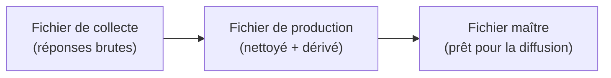
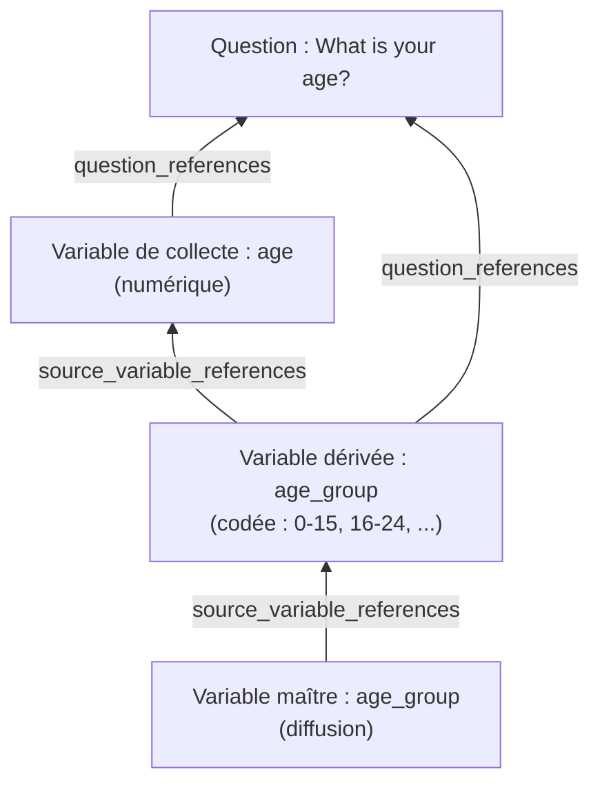
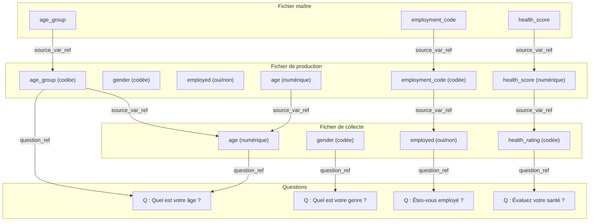

# Module 11 : Documenter les fichiers de données et la traçabilité des variables

!!! info "Ce que vous apprendrez"
    - Comprendre les trois étapes des données d'enquête : **collecte**, **production** et **diffusion**.
    - Créer des variables avec différentes représentations (`NumericRepresentation`, `CodeRepresentation`, `TextRepresentation`).
    - Lier chaque variable à sa **question source** avec `question_references`.
    - Modéliser des **variables dérivées** avec `source_variable_references` pour la traçabilité.
    - Suivre la **relation basée-sur** entre les variables de collecte et de production.
    - Construire une chaîne de provenance complète du fichier de diffusion jusqu'au questionnaire original.

**Prérequis :** [Module 10 : Flux de questionnaire](module-10-questionnaire-flows.md).

**Durée :** 60 min en autonomie / 75 min avec instructeur.

---

## 1. Que se passe-t-il après la collecte ?

Dans le module 10, vous avez construit un questionnaire.
Quand les répondants répondent à ce questionnaire, les réponses deviennent des **fichiers de données**.

Mais les données brutes vont rarement directement aux utilisateurs.
Elles passent par des étapes :



Chaque étape a son propre ensemble de variables.
DDI permet de documenter chaque étape et de suivre comment chaque variable se connecte aux autres.
C'est ce qu'on appelle la **traçabilité des données** ou la **provenance**.

## 2. Les trois fichiers de données

Nous utiliserons l'enquête sur la santé du module 10 comme exemple.

!!! example "Trois fichiers de données"

    **Fichier de collecte** : réponses brutes exactement comme collectées.

    | respondent_id | age | gender | employed | occupation | health_rating | smoker |
    |---|---|---|---|---|---|---|
    | R001 | 34 | Female | Yes | Teacher | Good | No |
    | R002 | 17 | Male | No | | Fair | No |
    | R003 | 68 | Female | No | | Excellent | Yes |

    **Fichier de production** : données nettoyées avec les variables originales et **dérivées**.

    | respondent_id | age | gender | employed | age_group | employment_status_code | health_score |
    |---|---|---|---|---|---|---|
    | R001 | 34 | 2 | 1 | 3 | 1 | 3 |
    | R002 | 17 | 1 | 0 | 2 | 0 | 2 |
    | R003 | 68 | 2 | 0 | 5 | 0 | 4 |

    **Fichier maître** : seulement les variables dérivées finales, prêtes pour la diffusion.

    | respondent_id | age_group | employment_status_code | health_score |
    |---|---|---|---|
    | R001 | 3 | 1 | 3 |
    | R002 | 2 | 0 | 2 |
    | R003 | 5 | 0 | 4 |

## 3. Préparer l'étude

Commencez par créer l'étude et les questions de notre enquête sur la santé.

```python
import ddi_l as ddi
from ddi_l.models.logicalproduct import (
    Variable,
    CodeList,
    Category,
    CodeItem,
    VariableRepresentation,
    NumericRepresentation,
    CodeRepresentation,
    TextRepresentation,
    NumberRange,
)
from ddi_l.models.datacollection import QuestionConstruct
from ddi_l.models.base import Reference, InternationalString

doc = ddi.new_study(
    title="National Health Survey: Data Documentation",
    agency="health.gc.ca",
)

# Créer les questions sources
q_age = doc.add_question(text="What is your age?")
q_gender = doc.add_question(text="What is your gender?")
q_employed = doc.add_question(text="Are you currently employed?")
q_occupation = doc.add_question(text="What is your occupation?")
q_health = doc.add_question(text="How would you rate your general health?")
q_smoke = doc.add_question(text="Do you smoke?")
```

## 4. Construire les variables de collecte

Les **variables de collecte** capturent exactement ce qui a été demandé.
Chacune a une **représentation** (numérique, texte ou codée) et un lien vers sa **question source**.

### Variable numérique : age

```python
v_age = doc.add_variable(name="age", question=q_age)
```

Le paramètre `question=` crée automatiquement une entrée `question_references` qui lie cette variable à la question dont elle provient.

### Variable codée : gender

Pour les variables codées, vous créez d'abord une `CodeList`, puis vous définissez la représentation de la variable pour l'utiliser.

```python
# Créer la liste de codes Genre
cl_gender = doc.add_code_list(name="Gender Codes")
doc.add_item(Category, name="Male")
doc.add_item(Category, name="Female")
doc.add_item(Category, name="Other")
```

### Variable texte : occupation

```python
v_occupation = doc.add_variable(name="occupation", question=q_occupation)
```

### Construire toutes les variables de collecte

```python
v_gender = doc.add_variable(name="gender", question=q_gender)
v_employed = doc.add_variable(name="employed", question=q_employed)
v_health = doc.add_variable(name="health_rating", question=q_health)
v_smoke = doc.add_variable(name="smoker", question=q_smoke)

print(f"Collection variables: {len(doc.variables)}")
# -> Collection variables: 6
```

Chaque variable de collecte référence sa question source.
C'est le premier maillon de la chaîne de provenance.

## 5. Qu'est-ce qu'une variable dérivée ?

Une **variable dérivée** est calculée à partir d'une ou plusieurs variables existantes.

Exemples :

| Variable dérivée | Variable(s) source | Dérivation |
| --- | --- | --- |
| `age_group` | `age` | Recodage : 0-15→1, 16-24→2, 25-44→3, 45-64→4, 65+→5 |
| `employment_status_code` | `employed` | Recodage : Yes→1, No→0 |
| `health_score` | `health_rating` | Recodage : Excellent→4, Good→3, Fair→2, Poor→1 |

En DDI, vous suivez cette dérivation avec `source_variable_references`, une liste de références pointant vers les variables utilisées pour calculer la valeur dérivée.

## 6. Créer des variables dérivées avec des références source

### Étape 1 : Créer la liste de codes des groupes d'âge

```python
cl_age_group = doc.add_code_list(name="Age Group Codes")
doc.add_item(Category, name="0-15")
doc.add_item(Category, name="16-24")
doc.add_item(Category, name="25-44")
doc.add_item(Category, name="45-64")
doc.add_item(Category, name="65+")
```

### Étape 2 : Créer la variable dérivée

```python
v_age_group = doc.add_variable(name="age_group", question=q_age)
```

### Étape 3 : Lier à sa variable source

Le champ clé est `source_variable_references`.
Il dit à quiconque lit les métadonnées : « Cette variable a été dérivée de ces autres variables. »

```python
v_age_group.source_variable_references = [
    Reference(
        agency="health.gc.ca",
        identifier=v_age.identifier,
        version="1",
    ),
]
```

Maintenant `age_group` a deux liens de provenance :

- **Question source** : pointe vers « What is your age? » (défini par `question=q_age`)
- **Variable source** : pointe vers la variable de collecte `age` (défini par `source_variable_references`)

## 7. Construire toutes les variables de production

Le fichier de production a à la fois les variables de collecte originales **et** les variables dérivées.

```python
# Dérivée : employment_status_code depuis employed
v_emp_code = doc.add_variable(name="employment_status_code", question=q_employed)
v_emp_code.source_variable_references = [
    Reference(
        agency="health.gc.ca",
        identifier=v_employed.identifier,
        version="1",
    ),
]

# Dérivée : health_score depuis health_rating
v_health_score = doc.add_variable(name="health_score", question=q_health)
v_health_score.source_variable_references = [
    Reference(
        agency="health.gc.ca",
        identifier=v_health.identifier,
        version="1",
    ),
]

print(f"Total variables (collection + derived): {len(doc.variables)}")
# -> Total variables (collection + derived): 9
```

## 8. La chaîne de provenance

Chaque variable du fichier de production peut être retracée jusqu'à :

1. **Sa question source** → « Qu'est-ce qui a été demandé ? »
2. **Sa ou ses variable(s) source** → « À partir de quelles données a-t-elle été calculée ? »

Et chaque variable de collecte peut être retracée jusqu'à :

1. **Sa question source** → « Qu'est-ce qui a été demandé ? »

Cela crée une **chaîne de traçabilité** complète :



En lisant de bas en haut, vous pouvez répondre :

- « D'où vient `age_group` dans le fichier maître ? » → De la variable de production `age_group`.
- « D'où vient le `age_group` de production ? » → Dérivée de `age` dans le fichier de collecte.
- « D'où vient `age` ? » → De la question « What is your age? »

## 9. Construire les variables du fichier maître

Le fichier maître contient seulement les variables dérivées prêtes pour la diffusion.
Celles-ci référencent les variables dérivées de l'étape de production comme leur source.

```python
# Variables du fichier maître référencent les variables de production
v_master_age_group = doc.add_variable(name="age_group_master", question=q_age)
v_master_age_group.source_variable_references = [
    Reference(
        agency="health.gc.ca",
        identifier=v_age_group.identifier,
        version="1",
    ),
]

v_master_emp = doc.add_variable(
    name="employment_status_master",
    question=q_employed,
)
v_master_emp.source_variable_references = [
    Reference(
        agency="health.gc.ca",
        identifier=v_emp_code.identifier,
        version="1",
    ),
]

v_master_health = doc.add_variable(
    name="health_score_master",
    question=q_health,
)
v_master_health.source_variable_references = [
    Reference(
        agency="health.gc.ca",
        identifier=v_health_score.identifier,
        version="1",
    ),
]

print(f"Master variables: 3")
print(f"Total variables in document: {len(doc.variables)}")
# -> Total variables in document: 12
```

## 10. Une variable avec plusieurs sources

Certaines variables dérivées combinent **plus d'une** variable source.
Par exemple, un indice de masse corporelle (IMC) est dérivé à la fois de la `taille` et du `poids`.

```python
q_height = doc.add_question(text="What is your height in cm?")
q_weight = doc.add_question(text="What is your weight in kg?")

v_height = doc.add_variable(name="height_cm", question=q_height)
v_weight = doc.add_variable(name="weight_kg", question=q_weight)

v_bmi = doc.add_variable(name="bmi")
v_bmi.source_variable_references = [
    Reference(
        agency="health.gc.ca",
        identifier=v_height.identifier,
        version="1",
    ),
    Reference(
        agency="health.gc.ca",
        identifier=v_weight.identifier,
        version="1",
    ),
]
```

La liste `source_variable_references` contient **deux** références.
Quiconque lit ces métadonnées sait que l'IMC dépend à la fois de la taille et du poids.

## 11. Du numérique au codé : le patron de dérivation

Un patron courant en traitement de données : une variable de collecte **numérique** devient une variable de production **codée**.

| Étape | Variable | Représentation | Valeurs exemples |
| --- | --- | --- | --- |
| Collecte | `age` | Numérique (0-120) | 34, 17, 68 |
| Production | `age_group` | Codée (5 catégories) | « 25-44 », « 16-24 », « 65+ » |

Cela se documente en DDI par :

1. Définir `age` avec une représentation numérique
2. Définir `age_group` avec une représentation codée qui pointe vers une liste de codes
3. Lier `age_group.source_variable_references` → `age`

La représentation indique aux utilisateurs **quel type de valeurs** la variable contient.
La référence source leur dit **d'où viennent ces valeurs**.

## 12. Résumé : le modèle complet de traçabilité



Chaque flèche est un objet `Reference` en DDI.
Vous pouvez suivre n'importe quelle variable jusqu'à la question originale.

---

!!! example "Scénario"
    Vous documentez le pipeline de données de l'enquête nationale sur la santé.
    Le fichier de collecte a 6 variables brutes du questionnaire.
    Le fichier de production ajoute 3 variables dérivées (age_group,
    employment_status_code, health_score).
    Le fichier maître a seulement les 3 variables dérivées pour la diffusion publique.
    Chaque variable doit être traçable jusqu'à sa source.

---

## Exercices

1. Créez une étude pour l'enquête sur la santé. Ajoutez 6 questions et 6 variables de collecte, chacune liée à sa question source. Affichez le compteur.

    **Résultat attendu :**

    ```text
    Questions: 6
    Variables: 6
    ```

    ??? success "Réponse"
        ```python
        import ddi_l as ddi

        doc = ddi.new_study(title="National Health Survey", agency="health.gc.ca")

        q_age = doc.add_question(text="What is your age?")
        q_gender = doc.add_question(text="What is your gender?")
        q_employed = doc.add_question(text="Are you currently employed?")
        q_occupation = doc.add_question(text="What is your occupation?")
        q_health = doc.add_question(text="How would you rate your general health?")
        q_smoke = doc.add_question(text="Do you smoke?")

        v_age = doc.add_variable(name="age", question=q_age)
        v_gender = doc.add_variable(name="gender", question=q_gender)
        v_employed = doc.add_variable(name="employed", question=q_employed)
        v_occupation = doc.add_variable(name="occupation", question=q_occupation)
        v_health = doc.add_variable(name="health_rating", question=q_health)
        v_smoke = doc.add_variable(name="smoker", question=q_smoke)

        print(f"Questions: {len(doc.questions)}")
        print(f"Variables: {len(doc.variables)}")
        ```

2. Créez une liste de codes pour les groupes d'âge (0-15, 16-24, 25-44, 45-64, 65+). Créez la variable dérivée `age_group` et liez-la à la variable de collecte `age` avec `source_variable_references`. Affichez le compteur.

    **Résultat attendu :**

    ```text
    Code lists: 1
    Variables: 7
    ```

    ??? success "Réponse"
        ```python
        from ddi_l.models.base import Reference
        from ddi_l.models.logicalproduct import Category

        cl = doc.add_code_list(name="Age Group Codes")
        for group in ("0-15", "16-24", "25-44", "45-64", "65+"):
            doc.add_item(Category, name=group)

        v_age_group = doc.add_variable(name="age_group", question=q_age)
        v_age_group.source_variable_references = [
            Reference(agency="health.gc.ca", identifier=v_age.identifier, version="1"),
        ]

        print(f"Code lists: {len(doc.code_lists)}")
        print(f"Variables: {len(doc.variables)}")
        ```

3. Créez deux autres variables dérivées : `employment_status_code` (depuis `employed`) et `health_score` (depuis `health_rating`). Chacune doit avoir `source_variable_references` pointant vers sa source. Affichez le total.

    **Résultat attendu :**

    ```text
    Variables: 9
    ```

    ??? success "Réponse"
        ```python
        v_emp_code = doc.add_variable(name="employment_status_code", question=q_employed)
        v_emp_code.source_variable_references = [
            Reference(agency="health.gc.ca", identifier=v_employed.identifier, version="1"),
        ]

        v_health_score = doc.add_variable(name="health_score", question=q_health)
        v_health_score.source_variable_references = [
            Reference(agency="health.gc.ca", identifier=v_health.identifier, version="1"),
        ]

        print(f"Variables: {len(doc.variables)}")
        ```

4. Créez 3 variables du fichier maître (`age_group_master`, `employment_status_master`, `health_score_master`). Chacune doit référencer sa variable dérivée de production comme source. Affichez le compteur final et vérifiez la traçabilité en affichant les références sources.

    ??? success "Réponse"
        ```python
        v_master_ag = doc.add_variable(name="age_group_master", question=q_age)
        v_master_ag.source_variable_references = [
            Reference(agency="health.gc.ca", identifier=v_age_group.identifier, version="1"),
        ]

        v_master_emp = doc.add_variable(name="employment_status_master", question=q_employed)
        v_master_emp.source_variable_references = [
            Reference(agency="health.gc.ca", identifier=v_emp_code.identifier, version="1"),
        ]

        v_master_hs = doc.add_variable(name="health_score_master", question=q_health)
        v_master_hs.source_variable_references = [
            Reference(agency="health.gc.ca", identifier=v_health_score.identifier, version="1"),
        ]

        print(f"Total variables: {len(doc.variables)}")  # -> Total variables: 12

        for v in doc.variables:
            sources = len(v.source_variable_references)
            if sources > 0:
                print(f"  {v.names[0].text}: {sources} source(s)")
        ```

        Six variables s'affichent, chacune avec `1 source(s)` : les trois variables
        dérivées de production et les trois variables du fichier maître.

5. (Bonus) Créez une variable IMC dérivée de deux sources (taille et poids). Vérifiez qu'elle a 2 références de variables sources.

    ??? success "Réponse"
        ```python
        v_height = doc.add_variable(name="height_cm")
        v_weight = doc.add_variable(name="weight_kg")

        v_bmi = doc.add_variable(name="bmi")
        v_bmi.source_variable_references = [
            Reference(agency="health.gc.ca", identifier=v_height.identifier, version="1"),
            Reference(agency="health.gc.ca", identifier=v_weight.identifier, version="1"),
        ]

        print(len(v_bmi.source_variable_references))  # -> 2
        ```

---

## Quiz

???+ question "Question 1 : Que suit source_variable_references ?"
    **A.** De quelles questions provient une variable.

    **B.** De quelles autres variables une variable dérivée a été calculée.

    **C.** Quelle liste de codes une variable utilise.

    **D.** À quel fichier de données une variable appartient.

    ??? success "Réponse"
        **B.** `source_variable_references` est une liste d'objets
        `Reference` pointant vers les variables utilisées pour
        calculer une variable dérivée.

???+ question "Question 2 : Comment lier une variable à sa question source ?"
    **A.** `v.question = q`

    **B.** `v.source_variable_references.append(q)`

    **C.** Utiliser `doc.add_variable(name=..., question=q)`

    **D.** `v.code_list = q`

    ??? success "Réponse"
        **C.** Le paramètre `question=` dans `doc.add_variable()` crée
        le lien automatiquement via `question_references`.

???+ question "Question 3 : Dans le modèle à trois fichiers, que contient le fichier de production ?"
    **A.** Seulement les variables dérivées.

    **B.** Seulement les variables de collecte.

    **C.** Les variables de collecte et les variables dérivées.

    **D.** Seulement le questionnaire.

    ??? success "Réponse"
        **C.** Le fichier de production a à la fois les variables de
        collecte originales (avec références basées-sur) et les nouvelles
        variables dérivées (avec références de variables sources).

???+ question "Question 4 : Une variable IMC est calculée à partir de la taille et du poids. Combien de source_variable_references a-t-elle ?"
    **A.** 0

    **B.** 1

    **C.** 2

    **D.** 3

    ??? success "Réponse"
        **C.** L'IMC a 2 références de variables sources, une pour
        la taille et une pour le poids, car il est dérivé des deux.

???+ question "Question 5 : Quel est l'objectif de la traçabilité des données ?"
    **A.** Réduire la taille des fichiers.

    **B.** Retracer n'importe quelle variable jusqu'à la question et les données originales.

    **C.** Supprimer les anciennes variables.

    **D.** Valider le schéma XML.

    ??? success "Réponse"
        **B.** La traçabilité des données permet de suivre n'importe
        quelle variable, même dans le fichier maître final, jusqu'à
        la variable de collecte originale et la question qui l'a générée.

---

!!! tip "Notes pour l'instructeur"
    - Commencez avec l'analogie : « Pensez à une recette. Le fichier de collecte, ce sont les ingrédients bruts. Le fichier de production, c'est la cuisson. Le fichier maître, c'est le plat servi. La provenance, c'est la recette qui vous dit d'où vient chaque ingrédient. »
    - Dessinez le pipeline à trois fichiers au tableau. Pour chaque variable, dessinez une flèche vers sa source. Demandez : « Pouvez-vous retracer cette variable maître jusqu'à la question originale ? »
    - Le concept de `source_variable_references` vs `question_references` peut être déroutant. Clarifiez : `question_references` dit « qu'est-ce qui a été demandé ». `source_variable_references` dit « quelles données ont été utilisées pour calculer ceci ».
    - Le patron numérique-vers-codé (age → age_group) est la dérivation la plus courante dans les enquêtes nationales. Montrez une table de recodage réelle : « âge 0-15 = groupe 1, 16-24 = groupe 2, ... »
    - Pour le personnel des INS : soulignez que cette traçabilité est ce que les auditeurs et chercheurs recherchent. « Si quelqu'un questionne un chiffre dans votre publication, pouvez-vous le retracer jusqu'aux données originales ? »
    - L'exercice 5 (IMC depuis deux sources) enseigne la dérivation multi-sources. C'est courant : IMC = poids / taille², revenu du ménage = somme des revenus des membres, etc.

---

**Voir aussi :** [Module 10 : Flux de questionnaire](module-10-questionnaire-flows.md) | [Guide utilisateur : Ajouter des variables](../user-guide.md#ajouter-des-variables)
