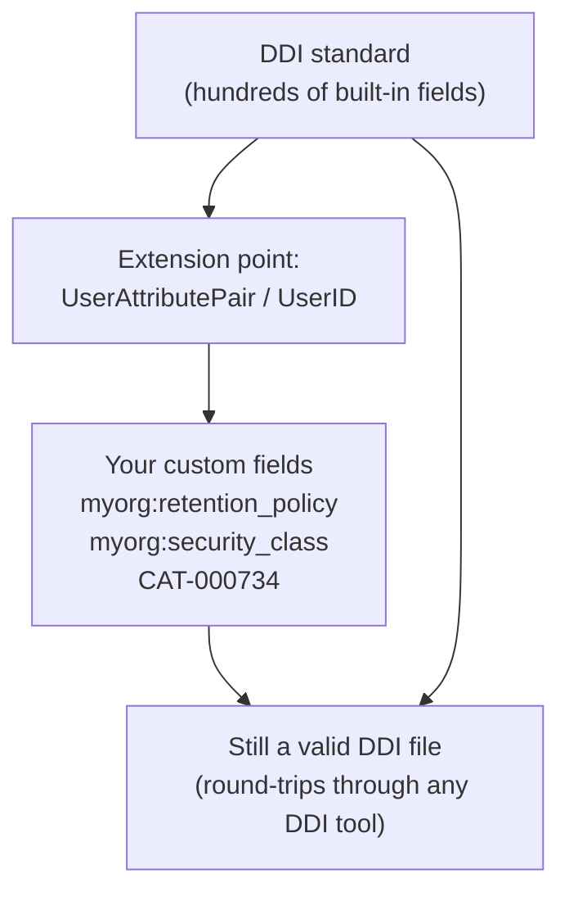

# Module 14: Custom fields: extend the standard for your organization

!!! info "What you will learn"
    - Understand why DDI is an **open, extensible standard**, and why that
      matters.
    - Add **organization-specific custom fields** that DDI has no built-in
      element for.
    - Use the standard's own extension point, `UserAttributePair`, so your
      custom fields stay inside **valid DDI XML**.
    - Attach organization-specific **external identifiers** with `UserID`.
    - Back a custom field with a **controlled vocabulary** by referencing a code list.
    - Design a **custom-field catalog** with naming conventions your whole team
      follows.
    - **Audit** a document to report which items carry your custom fields.
    - Confirm that custom fields **round-trip**: they survive save and reopen.

**Prerequisites:** [Module 13: Custom properties, find, remove, and validate](module-13-properties-find-validate.md).

**Time:** 45 min self-paced / 55 min instructor-led.

---

## 1. Why organizations need custom fields

DDI describes hundreds of things: questions, variables, concepts, code lists,
provenance, and more. But no standard can anticipate **every** field that
**every** organization needs.

A real archive or statistical office almost always has local metadata that DDI
has no built-in element for:

| Custom field | Example value | Who uses it |
| --- | --- | --- |
| Retention policy | "destroy after 7 years" | Records management |
| Security classification | "Protected B" | Information security |
| Data steward | "Data Governance Office" | Governance |
| Source system | "CRM-2024" | Data engineering |
| Internal catalogue number | "CAT-000734" | The archive |
| Embargo date | "2026-01-01" | Dissemination |
| Grant / project code | "SSHRC-435-2023" | Research administration |

Without a place to record these, teams end up keeping them in a **separate
spreadsheet** that drifts out of sync with the data. The goal of this module is
to keep them **in the DDI file itself**, where they travel with the metadata.

## 2. The openness of the DDI standard

Here is the important idea:

!!! quote "DDI is designed to be extended"
    DDI does not force you to choose between "use only the built-in fields" and
    "abandon the standard." It provides a **standardized extension point**,
    `UserAttributePair`, so you can add your own fields **without forking the
    schema and without leaving valid DDI**.

This openness is a deliberate design choice. Compare the alternatives:

- A **closed** format would force you to either drop your custom metadata or
  invent a private, incompatible variant that no other tool understands.
- DDI's **open** design lets you add `myorg:retention_policy` today, and the
  file is still a valid DDI document that any DDI-aware tool can read, validate,
  and preserve, even if that tool does not know what `myorg:retention_policy`
  means.

Every custom field you add in this module serializes to a small, standard block
of DDI XML:

```xml
<r:UserAttributePair>
  <r:AttributeKey>myorg:retention_policy</r:AttributeKey>
  <r:AttributeValue>destroy after 7 years</r:AttributeValue>
</r:UserAttributePair>
```

That is the openness of the standard, made concrete.

## 3. Where custom fields can live

A custom field can be attached to **any** DDI item: a study, a question, a
variable, a code list, anything. Set it at the level the field describes:

- **Study level**: facts about the whole dataset (retention, security class).
- **Item level**: facts about one variable or question (source system, quality
  flag).

```python
import ddi_l as ddi

doc = ddi.new_study(title="Household Survey", agency="survey.gc.ca")
q_income = doc.add_question(text="What is your household income?")
income = doc.add_variable(name="income", question=q_income)

# Study-level custom fields describe the whole dataset
study = doc.study_unit
study.set_property("myorg:retention_policy", "destroy after 7 years")
study.set_property("myorg:security_class", "Protected B")

print(study.properties)
# -> {'myorg:retention_policy': 'destroy after 7 years',
#     'myorg:security_class': 'Protected B'}
```

## 4. Add organization-specific fields

You already met `set_property` in [Module 13](module-13-properties-find-validate.md).
Here we use it deliberately, with a **namespace prefix** on every key so your
fields never collide with anyone else's:

```python
# Item-level custom fields describe one variable
income.set_property("myorg:source_system", "CRM-2024")
income.set_property("myorg:quality_flag", "validated")

print(income.get_property("myorg:source_system"))
# -> CRM-2024
```

!!! tip "Namespace your keys"
    Prefix every custom key with a short organization tag, like `myorg:` or
    `statcan:`. This is a convention, not a requirement, but it keeps *your*
    fields distinct from a partner's fields if two DDI files are ever merged.

## 5. Custom fields round-trip: they survive save and reopen

The payoff of using the standard's own extension point: your custom fields are
written into the DDI XML and read straight back. They are not lost on save.

```python
doc.save("household-survey.xml")

reopened = ddi.open_ddi("household-survey.xml")
print(reopened.variables[0].get_property("myorg:source_system"))
# -> CRM-2024
```

Because they live inside standard DDI, another team using different software can
open your file and still see `myorg:source_system`, even if their tool has no
idea what it means. **Nothing is silently dropped.** That is interoperability.

!!! tip "Keep editing after a save"
    `income` and `q_income` stay attached to `doc` after `doc.save()`, so you
    can keep setting properties on them; the next save includes the changes.

## 6. Organization-specific identifiers with UserID

Sometimes the custom field you need is an **identifier** from another system:
an internal catalogue number, a records-management ID, a source-database key.
DDI has a second extension point for exactly this: `UserID`, which carries a
value **and** a type.

```python
from ddi_l.models.base import UserID

income.user_ids.append(UserID(value="CAT-000734", type_of_user_id="InternalCatalogue"))

uid = income.user_ids[0]
print(f"{uid.type_of_user_id}: {uid.value}")
# -> InternalCatalogue: CAT-000734
```

Use `UserID` when the value **identifies** the item in another system, and a
custom property (`set_property`) when the value **describes** it.

## 7. A custom field backed by a controlled vocabulary (a code list)

Free-text values are flexible but easy to get wrong ("validated", "Validated",
"valid"). For a field that should take a fixed set of values, back it with a
**code list**, a controlled vocabulary. First build the vocabulary (the same
way you did in [Module 9](module-09-code-lists.md)), then have a custom field
**reference** it. Passing a DDI item as the value stores its **URN**, a stable
link to that code list.

A code list is not just a bag of categories. A `Category` carries the *meaning*
("validated"); the code list holds **`Code`** entries, and each code
**references** a category. Adding a category alone does not put it in any list;
you must append a `Code` that points at it. Give every code its own
UUID4-based URN, just as `add_code_list` and `add_item` do for the list and the
categories:

```python
from uuid import uuid4

from ddi_l.models.logicalproduct import Category, CodeItem

# 1. Build the controlled vocabulary. For each allowed value, create the
#    Category (its meaning) and a Code in the list that references it.
quality_codes = doc.add_code_list(name="Quality Flag Codes")
for value in ("validated", "provisional", "suppressed"):
    category = doc.add_item(Category, name=value)
    quality_codes.codes.append(
        CodeItem(
            agency=quality_codes.agency,
            identifier=str(uuid4()),  # UUID4 → this code's URN id
            version=quality_codes.version,
            value=value,
            category=category.to_reference(),
        )
    )

print(f"Allowed codes: {len(quality_codes.codes)}")  # -> 3

# 2. A custom field holding one value drawn from that vocabulary
income.set_property("myorg:quality_flag", "validated")

# 3. A custom field that references the code list defining the allowed values
income.set_property("myorg:quality_flag_codes", quality_codes)

print(income.get_property("myorg:quality_flag"))  # -> validated
print(income.get_property("myorg:quality_flag_codes").startswith("urn:ddi:"))
# -> True
```

The `myorg:quality_flag_codes` field stores the code list's URN, and that list
defines three codes, so anyone reading the metadata knows
`myorg:quality_flag` must be one of `validated`, `provisional`, or `suppressed`,
not free text. The custom field is governed by a controlled vocabulary, and that
link travels inside the DDI file.

## 8. Design a custom-field catalog

Openness is powerful, which means it needs **governance**. If every analyst
invents their own key, the fields become as messy as the spreadsheet you were
trying to replace. Agree on a small **catalog** and apply it consistently.

```python
# A documented catalog your whole team shares
CUSTOM_FIELDS = {
    "myorg:retention_policy": "How long to keep the data (records schedule).",
    "myorg:security_class": "Security classification (e.g. Protected B).",
    "myorg:source_system": "The system the data was extracted from.",
    "myorg:quality_flag": "Data-quality status (see Quality Flag Codes).",
    "myorg:steward": "The team accountable for the item.",
}


# Apply a field only if it is in the catalog (a guard against typos)
def set_catalog_field(item, key, value):
    if key not in CUSTOM_FIELDS:
        raise KeyError(f"{key!r} is not in the custom-field catalog")
    item.set_property(key, value)


set_catalog_field(income, "myorg:steward", "Data Governance Office")
print(income.get_property("myorg:steward"))
# -> Data Governance Office
```

A catalog gives you three things: consistent **keys**, documented **meanings**,
and a single place to review your organization's extensions.

## 9. Audit which items carry your custom fields

Because custom fields are just properties, you can **scan** a document and
report on them, which is useful for governance reviews and quality assurance.

```python
def items_with_custom_fields(doc, prefix="myorg:"):
    count = 0
    for collection in (doc.questions, doc.variables):
        for item in collection:
            if any(key.startswith(prefix) for key in item.properties):
                count += 1
    return count


income.set_property("myorg:source_system", "CRM-2024")
q_income.set_property("myorg:steward", "Survey Methods")

print(f"Items with custom fields: {items_with_custom_fields(doc)}")
# -> Items with custom fields: 2
```

## 10. Good practice: and one caution

- **Namespace your keys** (`myorg:...`) so they never collide.
- **Keep a catalog** so keys and meanings stay consistent.
- **Prefer controlled vocabularies** for fields with a fixed set of values.
- **Do not reinvent built-in DDI.** If DDI already has an element (a concept, a
  universe, a version rationale), use it. Custom fields are for what the standard
  genuinely does not cover.
- **Document your fields** for outside readers. A custom field is only as useful
  as the definition that travels with it. Your file stays valid DDI, but only
  *your* catalog explains what `myorg:security_class` means.

## 11. Summary: extend without breaking



The standard gives you a rich set of built-in fields **and** an open door for
the ones it does not have. You extend it for your organization's needs without
forking the schema and without leaving valid DDI.

---

!!! example "Scenario"
    Your archive receives a survey to catalogue. Records management needs a
    retention policy, information security needs a classification, and the
    archive needs its own catalogue number. DDI has a built-in field for none
    of them. Rather than keep a side spreadsheet, you record them as custom
    fields on the study and its variables, point the quality flag at a code
    list, and confirm they survive a save/reopen so they travel with the file.

---

## Exercises

1. Create a study with an `income` question and variable. Set two study-level
   custom fields: `myorg:retention_policy` = `"destroy after 7 years"` and
   `myorg:security_class` = `"Protected B"`. Print the study's properties.

    **Expected output:**

    ```text
    {'myorg:retention_policy': 'destroy after 7 years', 'myorg:security_class': 'Protected B'}
    ```

    ??? success "Answer"
        ```python
        import ddi_l as ddi

        doc = ddi.new_study(title="Household Survey", agency="survey.gc.ca")
        q_income = doc.add_question(text="What is your household income?")
        income = doc.add_variable(name="income", question=q_income)

        study = doc.study_unit
        study.set_property("myorg:retention_policy", "destroy after 7 years")
        study.set_property("myorg:security_class", "Protected B")

        print(study.properties)
        ```

2. Set `myorg:source_system` = `"CRM-2024"` on the `income` variable and
   `myorg:steward` = `"Survey Methods"` on the question. Write an audit that
   scans all questions and variables and counts how many carry a `myorg:` field.
   Print the count.

    **Expected output:**

    ```text
    Items with custom fields: 2
    ```

    ??? success "Answer"
        ```python
        income.set_property("myorg:source_system", "CRM-2024")
        q_income.set_property("myorg:steward", "Survey Methods")


        def items_with_custom_fields(doc, prefix="myorg:"):
            count = 0
            for collection in (doc.questions, doc.variables):
                for item in collection:
                    if any(key.startswith(prefix) for key in item.properties):
                        count += 1
            return count


        print(f"Items with custom fields: {items_with_custom_fields(doc)}")
        ```

3. Attach an organization-specific external identifier to the `income` variable:
   a `UserID` with value `"CAT-000734"` and type `"InternalCatalogue"`. Print
   it as `type: value`.

    **Expected output:**

    ```text
    InternalCatalogue: CAT-000734
    ```

    ??? success "Answer"
        ```python
        from ddi_l.models.base import UserID

        income.user_ids.append(UserID(value="CAT-000734", type_of_user_id="InternalCatalogue"))

        uid = income.user_ids[0]
        print(f"{uid.type_of_user_id}: {uid.value}")
        ```

4. Save the document, reopen it with `ddi.open_ddi()`, and read
   `myorg:source_system` back from the reopened variable to prove the custom
   field round-trips.

    **Expected output:**

    ```text
    CRM-2024
    ```

    ??? success "Answer"
        ```python
        doc.save("household-survey.xml")

        reopened = ddi.open_ddi("household-survey.xml")
        print(reopened.variables[0].get_property("myorg:source_system"))
        ```

5. (Bonus) Build a `Quality Flag Codes` code list with three codes
   (`validated`, `provisional`, `suppressed`), a controlled vocabulary. Set
   `myorg:quality_flag` = `"validated"` on the `income` variable, and set
   `myorg:quality_flag_codes` to the code list object so the field **references**
   that vocabulary. Verify the stored reference is a URN (starts with
   `"urn:ddi:"`).

    ??? success "Answer"
        ```python
        from uuid import uuid4

        from ddi_l.models.logicalproduct import Category, CodeItem

        # Build the controlled vocabulary. Each allowed value needs a Category (its
        # meaning) AND a Code in the list that references it; a Category alone is not
        # in any list. Each Code gets its own UUID4-based URN.
        quality_codes = doc.add_code_list(name="Quality Flag Codes")
        for value in ("validated", "provisional", "suppressed"):
            category = doc.add_item(Category, name=value)
            quality_codes.codes.append(
                CodeItem(
                    agency=quality_codes.agency,
                    identifier=str(uuid4()),
                    version=quality_codes.version,
                    value=value,
                    category=category.to_reference(),
                )
            )

        # A field whose value is drawn from the vocabulary, plus a field that
        # references the code list defining the allowed values
        income.set_property("myorg:quality_flag", "validated")
        income.set_property("myorg:quality_flag_codes", quality_codes)

        print(income.get_property("myorg:quality_flag"))
        print(income.get_property("myorg:quality_flag_codes").startswith("urn:ddi:"))
        ```

        !!! note "Objects stay attached"
            Variables you hold remain the objects the document serializes, before
            and after `save()`.

---

## Quiz

???+ question "Q1: Why can you add custom fields to a DDI document?"
    **A.** Because DDI ignores any element it does not recognize.

    **B.** Because DDI is an open, extensible standard with a built-in extension point.

    **C.** Because custom fields are stored in a separate file.

    **D.** You cannot: DDI only allows its built-in fields.

    ??? success "Answer"
        **B.** DDI is designed to be extended. `UserAttributePair` is a
        standardized extension point, so your custom fields stay inside valid
        DDI XML.

???+ question "Q2: Which DDI element stores a custom key-value field?"
    **A.** `Variable`

    **B.** `UserAttributePair`

    **C.** `CodeList`

    **D.** `VersionRationale`

    ??? success "Answer"
        **B.** `set_property` writes an `r:UserAttributePair` with an
        `AttributeKey` and an `AttributeValue`, the standard's extension point
        for custom fields.

???+ question "Q3: What happens to custom fields when you save and reopen a file?"
    **A.** They are dropped, because they are not standard.

    **B.** They survive: they are written to the DDI XML and read straight back.

    **C.** They are converted into built-in fields.

    **D.** They are moved to a separate spreadsheet.

    ??? success "Answer"
        **B.** Because they live inside standard DDI, custom fields round-trip.
        Any DDI-aware tool preserves them, even one that does not know what they
        mean.

???+ question "Q4: When should you use `UserID` instead of a custom property?"
    **A.** When the value **identifies** the item in another system.

    **B.** When the value is longer than 10 characters.

    **C.** Never; `UserID` is deprecated.

    **D.** Only for questions, never for variables.

    ??? success "Answer"
        **A.** Use `UserID` (with a `type_of_user_id`) when the value is an
        identifier from another system, such as an internal catalogue number.
        Use a custom property when the value **describes** the item.

???+ question "Q5: Why namespace custom keys like `myorg:retention_policy`?"
    **A.** DDI requires a colon in every key.

    **B.** To keep your fields distinct so they never collide with another organization's fields.

    **C.** To make the file smaller.

    **D.** To hide the field from other tools.

    ??? success "Answer"
        **B.** A namespace prefix is a convention that keeps your organization's
        custom fields distinct, which matters if two DDI files are ever merged.

---

!!! tip "Instructor notes"
    - Open with the "side spreadsheet" problem: every organization has local
      metadata, and it always drifts out of sync when kept outside the file.
      Custom fields fix that by keeping it in the DDI.
    - Make the openness point explicitly: DDI gives you a *standardized* way to
      extend it. Show the `UserAttributePair` XML on screen so learners see the
      custom field is still valid DDI, not a hack.
    - Draw the line between Module 13 and this module: Module 13 taught the
      `set_property` *mechanics*; this module is about *governing* extensions for
      an organization: catalogs, namespaces, controlled values, auditing.
    - The `UserID` vs custom-property distinction (identify vs describe) is a
      common point of confusion. Give two quick examples of each.
    - For NSO and archive staff: connect to real governance: records-retention
      schedules, security classifications, data-steward assignments. These are
      audited in practice, and Section 9's audit loop is how you report on them.
    - Emphasize the one caution: do not reinvent built-in DDI. Custom fields are
      for genuine gaps, not for re-doing concepts, universes, or versioning.

---

**See also:** [Module 13: Custom properties, find, remove, and validate](module-13-properties-find-validate.md) | [Module 15: Update and version](module-15-update-and-version.md) | [User guide: Custom properties](../user-guide.md)
