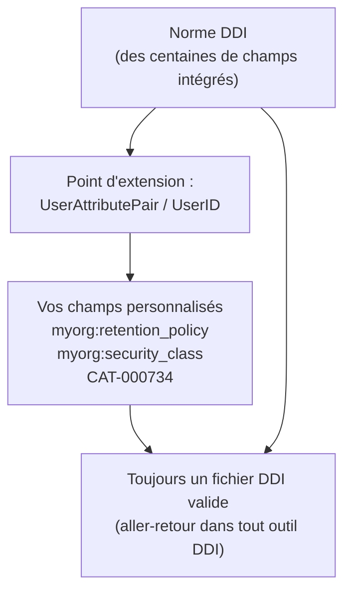

# Module 14 : Champs personnalisés : étendre la norme pour votre organisation

!!! info "Ce que vous apprendrez"
    - Comprendre pourquoi DDI est une **norme ouverte et extensible**, et
      pourquoi c'est important.
    - Ajouter des **champs personnalisés propres à l'organisation** pour lesquels
      DDI n'a aucun élément intégré.
    - Utiliser le point d'extension de la norme, `UserAttributePair`, pour que
      vos champs personnalisés restent dans du **XML DDI valide**.
    - Attacher des **identifiants externes** propres à l'organisation avec
      `UserID`.
    - Adosser un champ personnalisé à un **vocabulaire contrôlé** en référençant
      une liste de codes.
    - Concevoir un **catalogue de champs personnalisés** avec des conventions de
      nommage que toute l'équipe suit.
    - **Auditer** un document pour signaler quels éléments portent vos champs
      personnalisés.
    - Confirmer que les champs personnalisés font un **aller-retour** : ils
      survivent à l'enregistrement et à la réouverture.

**Prérequis :** [Module 13 : Propriétés personnalisées, recherche, suppression et validation](module-13-properties-find-validate.md).

**Durée :** 45 min en autonomie / 55 min avec instructeur.

---

## 1. Pourquoi les organisations ont besoin de champs personnalisés

DDI décrit des centaines de choses : questions, variables, concepts, listes de
codes, provenance, et plus. Mais aucune norme ne peut anticiper **tous** les
champs dont **chaque** organisation a besoin.

Une archive ou un institut de statistique réel a presque toujours des
métadonnées locales pour lesquelles DDI n'a aucun élément intégré :

| Champ personnalisé | Exemple de valeur | Qui l'utilise |
| --- | --- | --- |
| Politique de conservation | « détruire après 7 ans » | Gestion des documents |
| Classification de sécurité | « Protégé B » | Sécurité de l'information |
| Gestionnaire des données | « Bureau de gouvernance des données » | Gouvernance |
| Système source | « CRM-2024 » | Ingénierie des données |
| Numéro de catalogue interne | « CAT-000734 » | L'archive |
| Date d'embargo | « 2026-01-01 » | Diffusion |
| Code de projet / subvention | « CRSH-435-2023 » | Administration de la recherche |

Sans endroit où les consigner, les équipes finissent par les garder dans un
**chiffrier séparé** qui se désynchronise des données. Le but de ce module est
de les garder **dans le fichier DDI lui-même**, où ils voyagent avec les
métadonnées.

## 2. L'ouverture de la norme DDI

Voici l'idée importante :

!!! quote "DDI est conçu pour être étendu"
    DDI ne vous force pas à choisir entre « n'utiliser que les champs intégrés »
    et « abandonner la norme ». Il fournit un **point d'extension normalisé**,
    `UserAttributePair`, afin que vous puissiez ajouter vos propres champs
    **sans forker le schéma et sans quitter le DDI valide**.

Cette ouverture est un choix de conception délibéré. Comparez les possibilités :

- Un format **fermé** vous forcerait soit à abandonner vos métadonnées
  personnalisées, soit à inventer une variante privée et incompatible qu'aucun
  autre outil ne comprend.
- La conception **ouverte** de DDI vous laisse ajouter `myorg:retention_policy`
  aujourd'hui, et le fichier reste un document DDI valide que n'importe quel
  outil compatible DDI peut lire, valider et préserver, même s'il ne sait pas
  ce que `myorg:retention_policy` signifie.

Chaque champ personnalisé que vous ajoutez dans ce module se sérialise en un
petit bloc standard de XML DDI :

```xml
<r:UserAttributePair>
  <r:AttributeKey>myorg:retention_policy</r:AttributeKey>
  <r:AttributeValue>détruire après 7 ans</r:AttributeValue>
</r:UserAttributePair>
```

C'est l'ouverture de la norme, rendue concrète.

## 3. Où peuvent vivre les champs personnalisés

Un champ personnalisé peut être attaché à **n'importe quel** élément DDI : une
étude, une question, une variable, une liste de codes, tout. Placez-le au niveau
que le champ décrit :

- **Niveau étude** : des faits sur l'ensemble du jeu de données (conservation,
  classification de sécurité).
- **Niveau élément** : des faits sur une variable ou une question (système
  source, indicateur de qualité).

```python
import ddi_l as ddi

doc = ddi.new_study(title="Household Survey", agency="survey.gc.ca")
q_income = doc.add_question(text="What is your household income?")
income = doc.add_variable(name="income", question=q_income)

# Champs personnalisés au niveau étude : ils décrivent tout le jeu de données
study = doc.study_unit
study.set_property("myorg:retention_policy", "destroy after 7 years")
study.set_property("myorg:security_class", "Protected B")

print(study.properties)
# -> {'myorg:retention_policy': 'destroy after 7 years',
#     'myorg:security_class': 'Protected B'}
```

## 4. Ajouter des champs propres à l'organisation

Vous avez déjà rencontré `set_property` au
[Module 13](module-13-properties-find-validate.md). Ici, nous l'utilisons
délibérément, avec un **préfixe d'espace de noms** sur chaque clé afin que vos
champs n'entrent jamais en collision avec ceux d'un autre :

```python
# Champs personnalisés au niveau élément : ils décrivent une variable
income.set_property("myorg:source_system", "CRM-2024")
income.set_property("myorg:quality_flag", "validated")

print(income.get_property("myorg:source_system"))
# -> CRM-2024
```

!!! tip "Préfixez vos clés"
    Préfixez chaque clé personnalisée d'une courte étiquette d'organisation,
    comme `myorg:` ou `statcan:`. C'est une convention, pas une exigence, mais
    elle garde *vos* champs distincts de ceux d'un partenaire si deux fichiers
    DDI sont un jour fusionnés.

## 5. Les champs personnalisés font un aller-retour : ils survivent

Le bénéfice d'utiliser le point d'extension propre à la norme : vos champs
personnalisés sont écrits dans le XML DDI et relus directement. Ils ne sont pas
perdus à l'enregistrement.

```python
doc.save("household-survey.xml")

reopened = ddi.open_ddi("household-survey.xml")
print(reopened.variables[0].get_property("myorg:source_system"))
# -> CRM-2024
```

Parce qu'ils vivent dans du DDI standard, une autre équipe utilisant un logiciel
différent peut ouvrir votre fichier et voir encore `myorg:source_system`, même
si son outil ignore ce que cela signifie. **Rien n'est silencieusement
supprimé.** C'est l'interopérabilité.

!!! tip "Continuer après un enregistrement"
    `income` et `q_income` restent attachés à `doc` après `doc.save()` : vous
    pouvez continuer à leur ajouter des propriétés, et l'enregistrement suivant
    les inclut.

## 6. Identifiants propres à l'organisation avec UserID

Parfois le champ personnalisé dont vous avez besoin est un **identifiant**
provenant d'un autre système : un numéro de catalogue interne, un identifiant de
gestion documentaire, une clé de base de données source. DDI a un deuxième point
d'extension exactement pour cela : `UserID`, qui porte une valeur **et** un type.

```python
from ddi_l.models.base import UserID

income.user_ids.append(UserID(value="CAT-000734", type_of_user_id="InternalCatalogue"))

uid = income.user_ids[0]
print(f"{uid.type_of_user_id}: {uid.value}")
# -> InternalCatalogue: CAT-000734
```

Utilisez `UserID` quand la valeur **identifie** l'élément dans un autre système,
et une propriété personnalisée (`set_property`) quand la valeur le **décrit**.

## 7. Un champ personnalisé adossé à un vocabulaire contrôlé (une liste de codes)

Les valeurs en texte libre sont flexibles mais faciles à mal saisir
(« validated », « Validated », « valid »). Pour un champ qui devrait prendre un
ensemble fixe de valeurs, adossez-le à une **liste de codes**, un vocabulaire
contrôlé. Construisez d'abord le vocabulaire (comme au
[Module 9](module-09-code-lists.md)), puis faites qu'un champ personnalisé le
**référence**. Passer un élément DDI comme valeur stocke son **URN**, un lien
stable vers cette liste de codes.

Une liste de codes n'est pas un simple sac de catégories. Une `Category` porte le
*sens* (« validated ») ; la liste de codes contient des entrées **`Code`**, et
chaque code **référence** une catégorie. Ajouter une catégorie seule ne la place
dans aucune liste ; vous devez ajouter un `Code` qui pointe vers elle. Donnez à
chaque code son propre URN fondé sur un UUID4, tout comme `add_code_list` et
`add_item` le font pour la liste et les catégories :

```python
from uuid import uuid4

from ddi_l.models.logicalproduct import Category, CodeItem

# 1. Construire le vocabulaire contrôlé. Pour chaque valeur autorisée, créer la
#    Category (son sens) et un Code dans la liste qui la référence.
quality_codes = doc.add_code_list(name="Quality Flag Codes")
for value in ("validated", "provisional", "suppressed"):
    category = doc.add_item(Category, name=value)
    quality_codes.codes.append(
        CodeItem(
            agency=quality_codes.agency,
            identifier=str(uuid4()),  # UUID4 -> l'id d'URN de ce code
            version=quality_codes.version,
            value=value,
            category=category.to_reference(),
        )
    )

print(f"Codes autorisés : {len(quality_codes.codes)}")  # -> 3

# 2. Un champ personnalisé contenant une valeur tirée de ce vocabulaire
income.set_property("myorg:quality_flag", "validated")

# 3. Un champ personnalisé qui référence la liste de codes définissant les valeurs
income.set_property("myorg:quality_flag_codes", quality_codes)

print(income.get_property("myorg:quality_flag"))  # -> validated
print(income.get_property("myorg:quality_flag_codes").startswith("urn:ddi:"))
# -> True
```

Le champ `myorg:quality_flag_codes` stocke l'URN de la liste de codes, et cette
liste définit trois codes, de sorte que quiconque lit les
métadonnées sait que `myorg:quality_flag` doit être l'un de `validated`,
`provisional` ou `suppressed`, et non du texte libre. Le champ
personnalisé est régi par un vocabulaire contrôlé, et ce lien voyage à
l'intérieur du fichier DDI.

## 8. Concevoir un catalogue de champs personnalisés

L'ouverture est puissante, ce qui signifie qu'elle a besoin de **gouvernance**.
Si chaque analyste invente sa propre clé, les champs deviennent aussi
désordonnés que le chiffrier que vous essayiez de remplacer. Convenez d'un petit
**catalogue** et appliquez-le de manière cohérente.

```python
# Un catalogue documenté que toute votre équipe partage
CUSTOM_FIELDS = {
    "myorg:retention_policy": "Combien de temps conserver les donnees (calendrier).",
    "myorg:security_class": "Classification de securite (p. ex. Protege B).",
    "myorg:source_system": "Le systeme d'ou les donnees ont ete extraites.",
    "myorg:quality_flag": "Statut de qualite des donnees (voir Quality Flag Codes).",
    "myorg:steward": "L'equipe responsable de l'element.",
}


# N'applique un champ que s'il est dans le catalogue (garde-fou contre les fautes)
def set_catalog_field(item, key, value):
    if key not in CUSTOM_FIELDS:
        raise KeyError(f"{key!r} is not in the custom-field catalog")
    item.set_property(key, value)


set_catalog_field(income, "myorg:steward", "Data Governance Office")
print(income.get_property("myorg:steward"))
# -> Data Governance Office
```

Un catalogue vous donne trois choses : des **clés** cohérentes, des
**significations** documentées, et un seul endroit pour réviser les extensions de
votre organisation.

## 9. Auditer quels éléments portent vos champs personnalisés

Parce que les champs personnalisés ne sont que des propriétés, vous pouvez
**parcourir** un document et en faire rapport, ce qui est utile pour les revues de
gouvernance et l'assurance qualité.

```python
def items_with_custom_fields(doc, prefix="myorg:"):
    count = 0
    for collection in (doc.questions, doc.variables):
        for item in collection:
            if any(key.startswith(prefix) for key in item.properties):
                count += 1
    return count


income.set_property("myorg:source_system", "CRM-2024")
q_income.set_property("myorg:steward", "Survey Methods")

print(f"Items with custom fields: {items_with_custom_fields(doc)}")
# -> Items with custom fields: 2
```

## 10. Bonnes pratiques : et une mise en garde

- **Préfixez vos clés** (`myorg:...`) pour qu'elles n'entrent jamais en collision.
- **Tenez un catalogue** pour que les clés et les significations restent cohérentes.
- **Préférez les vocabulaires contrôlés** pour les champs à ensemble fixe de valeurs.
- **Ne réinventez pas le DDI intégré.** Si DDI a déjà un élément (un concept, un
  univers, une justification de version), utilisez-le. Les champs personnalisés
  sont pour ce que la norme ne couvre vraiment pas.
- **Documentez vos champs** pour les lecteurs externes. Un champ personnalisé
  n'est utile que par la définition qui l'accompagne. Votre fichier reste du DDI
  valide, mais seul *votre* catalogue explique ce que `myorg:security_class`
  signifie.

## 11. Résumé : étendre sans casser



La norme vous donne un riche ensemble de champs intégrés **et** une porte
ouverte pour ceux qu'elle n'a pas. Vous l'étendez pour les besoins de votre
organisation sans forker le schéma et sans quitter le DDI valide.

---

!!! example "Scénario"
    Votre archive reçoit une enquête à cataloguer. La gestion documentaire a
    besoin d'une politique de conservation, la sécurité de l'information d'une
    classification, et l'archive de son propre numéro de catalogue, et aucun n'a
    de champ intégré dans DDI. Plutôt que de tenir un chiffrier parallèle, vous
    les consignez comme champs personnalisés sur l'étude et ses variables, faites
    pointer l'indicateur de qualité vers une liste de codes, et confirmez qu'ils
    survivent à un aller-retour enregistrement/réouverture afin qu'ils voyagent
    avec le fichier.

---

## Exercices

1. Créez une étude avec une question et une variable `income`. Définissez deux
   champs personnalisés au niveau étude : `myorg:retention_policy` =
   `"destroy after 7 years"` et `myorg:security_class` = `"Protected B"`.
   Affichez les propriétés de l'étude.

    **Résultat attendu :**

    ```text
    {'myorg:retention_policy': 'destroy after 7 years', 'myorg:security_class': 'Protected B'}
    ```

    ??? success "Réponse"
        ```python
        import ddi_l as ddi

        doc = ddi.new_study(title="Household Survey", agency="survey.gc.ca")
        q_income = doc.add_question(text="What is your household income?")
        income = doc.add_variable(name="income", question=q_income)

        study = doc.study_unit
        study.set_property("myorg:retention_policy", "destroy after 7 years")
        study.set_property("myorg:security_class", "Protected B")

        print(study.properties)
        ```

2. Définissez `myorg:source_system` = `"CRM-2024"` sur la variable `income` et
   `myorg:steward` = `"Survey Methods"` sur la question. Écrivez un audit qui
   parcourt toutes les questions et variables et compte combien portent un champ
   `myorg:`. Affichez le compteur.

    **Résultat attendu :**

    ```text
    Items with custom fields: 2
    ```

    ??? success "Réponse"
        ```python
        income.set_property("myorg:source_system", "CRM-2024")
        q_income.set_property("myorg:steward", "Survey Methods")

        def items_with_custom_fields(doc, prefix="myorg:"):
            count = 0
            for collection in (doc.questions, doc.variables):
                for item in collection:
                    if any(key.startswith(prefix) for key in item.properties):
                        count += 1
            return count


        print(f"Items with custom fields: {items_with_custom_fields(doc)}")
        ```

3. Attachez un identifiant externe propre à l'organisation à la variable
   `income` : un `UserID` de valeur `"CAT-000734"` et de type
   `"InternalCatalogue"`. Affichez-le sous la forme `type: valeur`.

    **Résultat attendu :**

    ```text
    InternalCatalogue: CAT-000734
    ```

    ??? success "Réponse"
        ```python
        from ddi_l.models.base import UserID

        income.user_ids.append(UserID(value="CAT-000734", type_of_user_id="InternalCatalogue"))

        uid = income.user_ids[0]
        print(f"{uid.type_of_user_id}: {uid.value}")
        ```

4. Enregistrez le document, rouvrez-le avec `ddi.open_ddi()`, et relisez
   `myorg:source_system` depuis la variable rouverte pour prouver que le champ
   personnalisé fait un aller-retour.

    **Résultat attendu :**

    ```text
    CRM-2024
    ```

    ??? success "Réponse"
        ```python
        doc.save("household-survey.xml")

        reopened = ddi.open_ddi("household-survey.xml")
        print(reopened.variables[0].get_property("myorg:source_system"))
        ```

5. (Bonus) Construisez une liste de codes `Quality Flag Codes` avec trois codes
   (`validated`, `provisional`, `suppressed`), un vocabulaire contrôlé.
   Définissez `myorg:quality_flag` = `"validated"` sur la variable `income`, et
   définissez `myorg:quality_flag_codes` sur l'objet liste de codes pour que le
   champ **référence** ce vocabulaire. Vérifiez que la référence stockée est un
   URN (commence par `"urn:ddi:"`).

    ??? success "Réponse"
        ```python
        from uuid import uuid4

        from ddi_l.models.logicalproduct import Category, CodeItem

        # Construire le vocabulaire contrôlé. Chaque valeur autorisée a besoin d'une
        # Category (son sens) ET d'un Code dans la liste qui la référence ; une Category
        # seule n'est dans aucune liste. Chaque Code reçoit son propre URN basé sur un UUID4.
        quality_codes = doc.add_code_list(name="Quality Flag Codes")
        for value in ("validated", "provisional", "suppressed"):
            category = doc.add_item(Category, name=value)
            quality_codes.codes.append(
                CodeItem(
                    agency=quality_codes.agency,
                    identifier=str(uuid4()),
                    version=quality_codes.version,
                    value=value,
                    category=category.to_reference(),
                )
            )

        # Un champ dont la valeur vient du vocabulaire, plus un champ qui référence
        # la liste de codes définissant les valeurs autorisées
        income.set_property("myorg:quality_flag", "validated")
        income.set_property("myorg:quality_flag_codes", quality_codes)

        print(income.get_property("myorg:quality_flag"))
        print(income.get_property("myorg:quality_flag_codes").startswith("urn:ddi:"))
        ```

        !!! note "Les objets restent attachés"
            Les variables que vous tenez restent les objets que le document
            sérialise, avant comme après `save()`.

---

## Quiz

???+ question "Question 1 : Pourquoi pouvez-vous ajouter des champs personnalisés à un document DDI ?"
    **A.** Parce que DDI ignore tout élément qu'il ne reconnaît pas.

    **B.** Parce que DDI est une norme ouverte et extensible avec un point d'extension intégré.

    **C.** Parce que les champs personnalisés sont stockés dans un fichier séparé.

    **D.** Vous ne pouvez pas : DDI n'autorise que ses champs intégrés.

    ??? success "Réponse"
        **B.** DDI est conçu pour être étendu. `UserAttributePair` est un point
        d'extension normalisé, de sorte que vos champs personnalisés restent dans
        du XML DDI valide.

???+ question "Question 2 : Quel élément DDI stocke un champ clé-valeur personnalisé ?"
    **A.** `Variable`

    **B.** `UserAttributePair`

    **C.** `CodeList`

    **D.** `VersionRationale`

    ??? success "Réponse"
        **B.** `set_property` écrit un `r:UserAttributePair` avec un
        `AttributeKey` et un `AttributeValue`, le point d'extension de la norme
        pour les champs personnalisés.

???+ question "Question 3 : Qu'advient-il des champs personnalisés lors de l'enregistrement et de la réouverture d'un fichier ?"
    **A.** Ils sont supprimés, car ils ne sont pas standard.

    **B.** Ils survivent : ils sont écrits dans le XML DDI et relus directement.

    **C.** Ils sont convertis en champs intégrés.

    **D.** Ils sont déplacés dans un chiffrier séparé.

    ??? success "Réponse"
        **B.** Parce qu'ils vivent dans du DDI standard, les champs personnalisés
        font un aller-retour. Tout outil compatible DDI les préserve, même un qui
        ne sait pas ce qu'ils signifient.

???+ question "Question 4 : Quand utiliser `UserID` plutôt qu'une propriété personnalisée ?"
    **A.** Quand la valeur **identifie** l'élément dans un autre système.

    **B.** Quand la valeur fait plus de 10 caractères.

    **C.** Jamais ; `UserID` est obsolète.

    **D.** Seulement pour les questions, jamais pour les variables.

    ??? success "Réponse"
        **A.** Utilisez `UserID` (avec un `type_of_user_id`) quand la valeur est
        un identifiant provenant d'un autre système, comme un numéro de catalogue
        interne. Utilisez une propriété personnalisée quand la valeur **décrit**
        l'élément.

???+ question "Question 5 : Pourquoi préfixer les clés personnalisées comme `myorg:retention_policy` ?"
    **A.** DDI exige un deux-points dans chaque clé.

    **B.** Pour garder vos champs distincts afin qu'ils n'entrent jamais en collision avec ceux d'une autre organisation.

    **C.** Pour réduire la taille du fichier.

    **D.** Pour cacher le champ aux autres outils.

    ??? success "Réponse"
        **B.** Un préfixe d'espace de noms est une convention qui garde les
        champs personnalisés de votre organisation distincts, ce qui compte si deux
        fichiers DDI sont un jour fusionnés.

---

!!! tip "Notes pour l'instructeur"
    - Commencez par le problème du « chiffrier parallèle » : chaque organisation
      a des métadonnées locales, et elles se désynchronisent toujours quand elles
      sont gardées hors du fichier. Les champs personnalisés corrigent cela en
      les gardant dans le DDI.
    - Faites le point d'ouverture explicitement : DDI vous donne une façon
      *normalisée* de l'étendre. Montrez le XML `UserAttributePair` à l'écran pour
      que les apprenants voient que le champ personnalisé est toujours du DDI
      valide, pas un bricolage.
    - Tracez la ligne entre le Module 13 et ce module : le Module 13 enseignait la
      *mécanique* de `set_property` ; ce module porte sur la *gouvernance* des
      extensions pour une organisation : catalogues, espaces de noms, valeurs
      contrôlées, audit.
    - La distinction `UserID` vs propriété personnalisée (identifier vs décrire)
      est une source de confusion courante. Donnez deux exemples rapides de
      chaque.
    - Pour le personnel des INS et des archives : reliez à la gouvernance réelle :
      calendriers de conservation, classifications de sécurité, affectation de
      gestionnaires de données. Ce sont des choses auditées en pratique, et la
      boucle d'audit de la section 9 est la façon d'en faire rapport.
    - Insistez sur la mise en garde : ne réinventez pas le DDI intégré. Les champs
      personnalisés sont pour de véritables lacunes, pas pour refaire les
      concepts, les univers ou le versionnage.

---

**Voir aussi :** [Module 13 : Propriétés personnalisées, recherche, suppression et validation](module-13-properties-find-validate.md) | [Module 15 : Mise à jour et versionnage](module-15-update-and-version.md) | [Guide utilisateur : Propriétés personnalisées](../user-guide.md)
