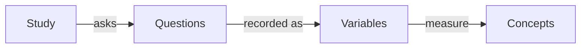

# ddi-l

[DDI](https://ddialliance.org/) (Data Documentation Initiative) is the
international standard that statistical agencies, data archives and
researchers use to describe surveys and datasets: what was asked, what each
variable means, and who was surveyed. `ddi-l` lets you write and check that
documentation in Python instead of editing XML by hand.

You work with studies, questions and variables as Python objects, and `ddi-l`
writes the XML. It reads, validates and lints
[DDI Lifecycle](https://ddialliance.org/Specification/DDI-Lifecycle/) 3.1,
3.2 and 3.3, so archives can check older holdings with the same tool, and it
authors new documents in DDI 3.3.

<div class="ddi-cta-group" markdown>

[Install ddi-l](installation.md#install-from-pypi){ .md-button .md-button--primary }
[Start the training curriculum](curriculum/index.md){ .md-button .md-button--secondary .md-button--outlined }

</div>

## How a study fits together

A DDI study holds the questions you asked. Each answer becomes a variable in
your dataset, and each variable measures a concept.



## Quick start

```python
import ddi_l as ddi

# Create a new study
doc = ddi.new_study(title="Household Survey", agency="example.org")

# Add a question and the variable that records its answer. `label=` is
# optional, but `ddi lint` warns about every item without one.
q_age = doc.add_question(text="How old are you?", label="Age question")
doc.add_variable(name="Age", question=q_age, label="Age in years")

# Save to XML
doc.save("household-survey.xml")
```

```python
# Open an existing study
doc = ddi.open_ddi("household-survey.xml")

for v in doc.variables:
    print(v.identifier)
```

Check the file from the command line. Both commands exit with status 0 when
the file is clean, so you can use them in scripts and CI:

```bash
ddi validate household-survey.xml
ddi lint household-survey.xml
```

## Install

Install `ddi-l` from PyPI. The `full` extra adds the faster `lxml` backend
(see [Installation](installation.md)).

=== "pip"
    ```bash
    pip install ddi-l
    ```

=== "uv"
    ```bash
    uv add ddi-l
    uv run ddi --help
    ```

=== "Poetry"
    ```bash
    poetry add ddi-l
    poetry run ddi --help
    ```

## Where to go next

<div class="grid cards landing-tiles" markdown>

- **Learn**

    A 16-module course that takes you from "what is metadata?" to a fully
    documented, validated and versioned DDI package. No DDI or XML experience
    needed.

    [Training curriculum →](curriculum/index.md){ .md-button .md-button--primary }

- **Validate**

    Validate documents against the DDI schemas, run the lint rules, and add
    the checks to CI.

    [Validation guide →](validation.md){ .md-button .md-button--secondary .md-button--outlined }

- **Use the CLI**

    Validate, round-trip and convert files with the `ddi` command.

    [CLI recipes →](cli-recipes.md){ .md-button .md-button--secondary .md-button--outlined }

- **Not using Python?**

    Call `ddi-l` from R through reticulate, or from any language over its
    HTTP API.

    [Use from R →](r-users.md){ .md-button .md-button--secondary .md-button--outlined }
    [HTTP API →](server.md){ .md-button .md-button--secondary .md-button--outlined }

</div>

For a one-page tour of the `Document` API, see the [user guide](user-guide.md).
The [API reference](api.md) and the [models reference](models.md) cover every
class. To contribute, start with the
[contributor guide](https://github.com/pbisson44/ddi-l/blob/main/CONTRIBUTING.md);
the [development guide](DEVELOPMENT.md) covers the architecture, code
generation and release process in depth.

## Cite ddi-l

If you use `ddi-l` in research or in an archive's workflow, please cite it:

> Bisson, P. (2026). *ddi-l: a Python toolkit for DDI Lifecycle 3.3 XML
> documents* (Version 0.1.0) [Computer software].
> <https://github.com/pbisson44/ddi-l>

```bibtex
@software{bisson_ddi_l,
  author  = {Bisson, Philippe},
  title   = {ddi-l: a Python toolkit for DDI Lifecycle 3.3 XML documents},
  year    = {2026},
  version = {0.1.0},
  url     = {https://github.com/pbisson44/ddi-l},
  license = {MIT}
}
```

The repository's
[`CITATION.cff`](https://github.com/pbisson44/ddi-l/blob/main/CITATION.cff)
holds the same metadata; GitHub's "Cite this repository" button exports it in
other formats.
