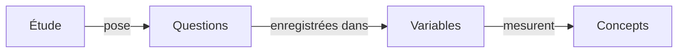

# ddi-l

Le [DDI](https://ddialliance.org/) (Data Documentation Initiative) est la
norme internationale qu'utilisent les organismes statistiques, les archives de
données et les chercheurs pour décrire les enquêtes et les jeux de données : ce
qui a été demandé, ce que signifie chaque variable et qui a été interrogé.
`ddi-l` vous permet de rédiger et de vérifier cette documentation en Python
plutôt que d'éditer le XML à la main.

Vous manipulez les études, les questions et les variables comme des objets
Python, et `ddi-l` écrit le XML. La bibliothèque lit, valide et analyse le
[DDI Lifecycle](https://ddialliance.org/Specification/DDI-Lifecycle/) 3.1,
3.2 et 3.3, ce qui permet aux archives de vérifier leurs fonds plus anciens
avec le même outil, et elle produit les nouveaux documents en DDI 3.3.

<div class="ddi-cta-group">

<a class="md-button md-button--primary" href="installation.md#installer-depuis-pypi">Installer ddi-l</a>
<a class="md-button md-button--secondary md-button--outlined" href="curriculum/index.md">Commencer le programme de formation</a>

</div>

## Comment s'articule une étude

Une étude DDI contient les questions posées. Chaque réponse devient une
variable de votre jeu de données, et chaque variable mesure un concept.



## Démarrage rapide

```python
import ddi_l as ddi

# Créer une nouvelle étude
doc = ddi.new_study(title="Enquête ménages", agency="example.org")

# Ajouter une question et la variable qui enregistre sa réponse. `label=` est
# facultatif, mais `ddi lint` signale chaque élément qui n'en a pas.
q_age = doc.add_question(text="Quel âge avez-vous ?", label="Question sur l'âge")
doc.add_variable(name="Age", question=q_age, label="Âge en années")

# Enregistrer en XML
doc.save("enquete-menages.xml")
```

```python
# Ouvrir une étude existante
doc = ddi.open_ddi("enquete-menages.xml")

for v in doc.variables:
    print(v.identifier)
```

Vérifiez le fichier en ligne de commande. Les deux commandes se terminent avec
le code 0 quand le fichier est propre, ce qui permet de les utiliser dans des
scripts et en CI :

```bash
ddi validate enquete-menages.xml
ddi lint enquete-menages.xml
```

## Installer

Installez `ddi-l` depuis PyPI. L'extra `full` ajoute le moteur `lxml`, plus
rapide (voir [Installation](installation.md)).

=== "pip"
    ```bash
    pip install ddi-l
    ```

=== "uv"
    ```bash
    uv add ddi-l
    uv run ddi --help
    ```

=== "Poetry"
    ```bash
    poetry add ddi-l
    poetry run ddi --help
    ```

## Pour continuer

<div class="grid cards landing-tiles" markdown>

- **Apprendre**

    Un cours en 16 modules qui vous mène de « qu'est-ce que les
    métadonnées ? » à un paquet DDI entièrement documenté, validé et
    versionné. Aucune expérience du DDI ni du XML n'est requise.

    [Programme de formation →](curriculum/index.md){ .md-button .md-button--primary }

- **Valider**

    Validez les documents par rapport aux schémas DDI, exécutez les règles de
    lint et ajoutez ces contrôles à la CI.

    [Guide de validation →](validation.md){ .md-button .md-button--secondary .md-button--outlined }

- **Utiliser la CLI**

    Validez, faites l'aller-retour et convertissez des fichiers avec la
    commande `ddi`.

    [Recettes CLI →](cli-recipes.md){ .md-button .md-button--secondary .md-button--outlined }

- **Vous n'utilisez pas Python ?**

    Appelez `ddi-l` depuis R avec reticulate, ou depuis n'importe quel langage
    par son API HTTP.

    [Depuis R →](r-users.md){ .md-button .md-button--secondary .md-button--outlined }
    [API HTTP →](server.md){ .md-button .md-button--secondary .md-button--outlined }

</div>

Pour un tour d'horizon de l'API `Document` en une page, consultez le
[guide d'utilisation](user-guide.md). La [référence de l'API](api.md) et la
[référence des modèles](models.md) décrivent chaque classe. Pour contribuer,
commencez par le
[guide des contributeurs](https://github.com/pbisson44/ddi-l/blob/main/CONTRIBUTING.md) ;
le [guide de développement](DEVELOPMENT.md) détaille l'architecture, la
génération de code et le processus de publication.

## Citer ddi-l

Si vous utilisez `ddi-l` dans une recherche ou dans le flux de travail d'une
archive, merci de le citer :

> Bisson, P. (2026). *ddi-l: a Python toolkit for DDI Lifecycle 3.3 XML
> documents* (Version 0.1.0) [Logiciel].
> <https://github.com/pbisson44/ddi-l>

```bibtex
@software{bisson_ddi_l,
  author  = {Bisson, Philippe},
  title   = {ddi-l: a Python toolkit for DDI Lifecycle 3.3 XML documents},
  year    = {2026},
  version = {0.1.0},
  url     = {https://github.com/pbisson44/ddi-l},
  license = {MIT}
}
```

Le fichier
[`CITATION.cff`](https://github.com/pbisson44/ddi-l/blob/main/CITATION.cff)
du dépôt contient les mêmes métadonnées ; le bouton « Cite this repository »
de GitHub les exporte dans d'autres formats.
